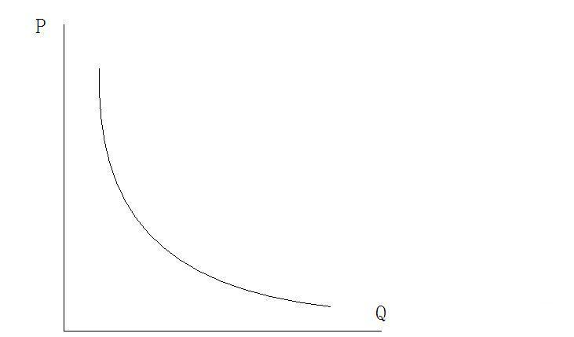

# Section 1: The Law of Demand and its Key Points

The law of demand says, “Ceteris paribus (other factors remaining unchanged), less is demanded at a higher price, and vice versa.” In terms of geometry, it is a curve sloping downwards. (See Fig8-1)

  

Figure 8-1

With respect to the demand curve, there are several key points need to be concerned.

(1)It is the change in price that causes the change in quantity demanded, not the other way around. In other words, price is an independent variable, while quantity demanded is a dependent variable.  However, as can be seen in fig8-1, price is plotted on the y-axis and quantity demanded on the x-axis, which is exactly contrary to the common situation in mathematics where independent variable is plotted on x-axis and dependent variables is plotted on the y-axis. Why? There is no special reason, just because Marshall, who invented the demand curve, plotted price on the y-axis and quantity demanded on the x-axis, which is followed by all economists, thus becomes a convention.

(2) Price is an observable fact, but strictly speaking, it is not the nominal price or monetary price, but the relative price or real price expressed in other goods. For example, suppose there are two goods: a cell phone and a bottle of water. The cell phone is 1000 RMB and the bottle of water is 1 RMB, which are all monetary prices (nominal prices). The real price of the cell phone should be 1000 bottles of water, and that of one bottle of water is 1/1000 cell phone. As mentioned in Lecture 6, in price theory (or so-called microeconomics) there is only barter without money, so the price of one good is the relative price expressed by another good. Or although there is money, the value of money is stable, so the monetary price is not out of line with the real price. However, if the value of money is unstable, the monetary price will be out of line with the real price. For example, if the monetary price of a cell phone rises to 2000 RMB and that of a bottle of water to 2 RMB, their relative price is still 1000 bottles of water for one cell phone or 1/1000 cell phone for one bottle of water. In other words, the real price has not changed, only the money devalues which means there is inflation. Price theory does not study the influence of money, so the price in it refers to relative prices (real prices).

(3) Quantity demanded is not an observable fact, but individual's intention, and is different from quantity of purchase which is a fact. Strictly speaking, the law of demand says, “Ceteris paribus, people tend to buy less when price rise, and vice versa. Whether this (psychological) tendency leads to real purchase depends on some specific constraints. Moreover, if quantity demanded is also a fact, the two variables of the demand curve are both facts. Applying the law of demand to explain phenomena is using a fact to explain another fact, which is not allowed by the methodology of science.
