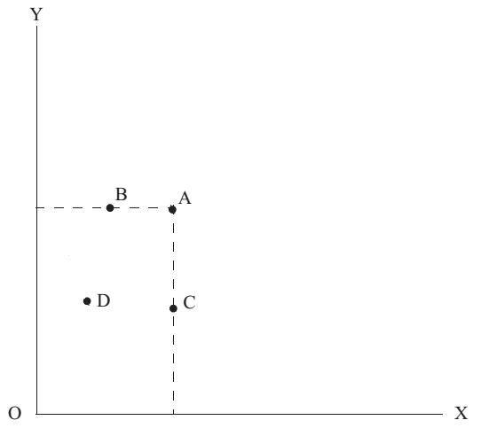

# Section 1: Two Axioms of Consumer Theory

There are two axioms in consumer theory, both of which are postulates about human’s preference (the same as “taste”). One is the axiom of comparison: a person can compare any two baskets A and B of commodities. Such a comparison must lead to one of the three following results: he or she (i) prefers basket A over B, or (ii) prefers basket B over A, or (iii) is indifferent between A and B.

The other is the axiom of transitivity: consider any three baskets A, B, and C. If a consumer prefers A to B, and also prefers B to C, he or she must prefer A to C. Similarly, a person who is indifferent between A and B, and is also indifferent between B and C, must be indifferent between A and C.

These two axioms taken together lead to the proposition of rank ordering of preference: a consumer can consistently rank all baskets of commodities in order of preference. This ranking is called “the preference function.”

  

Figure 10-1

Based on the above axioms, proposition and the definition of “goods” introduced in Lecture 4, we can draw the Fig.10-1. The x-axis and y-axis respectively represent the quantity of good X and good Y, and any point in the rectangular coordinate is a basket of different quantities of these two goods. For example, the x-coordinate of point A represents the quantity of good X in the basket A, while the y-coordinate is the quantity of good Y. According to the above axioms, laws and the definition of “goods”, we can judge that point A is preferred to D, because it contains more of X and Y than D does. It is the preference ranking for the two goods according to the proposition of rank ordering of preference.

However, here is the question: which is better, point B or point C? How to rank their orders? The quantity of Y at point B is more than that at point C, while the quantity of X at point B is less than that at point C. The former means B is preferred to C, but the latter means C is preferred to B, which implies that only with the above axioms, proposition and the definitions of “goods”, the constraints are not enough to infer human’s behavior of choosing which basket of goods between B and C.

The answer to this question is the analysis tool of “indifference curve” which will be derived in the later section.

