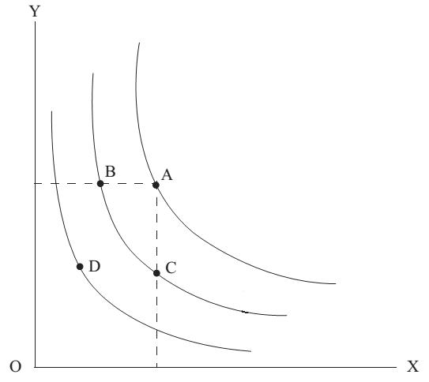
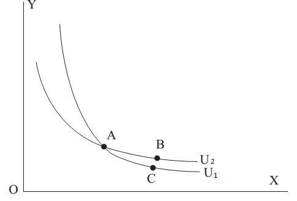
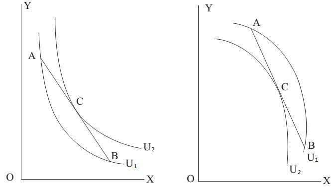
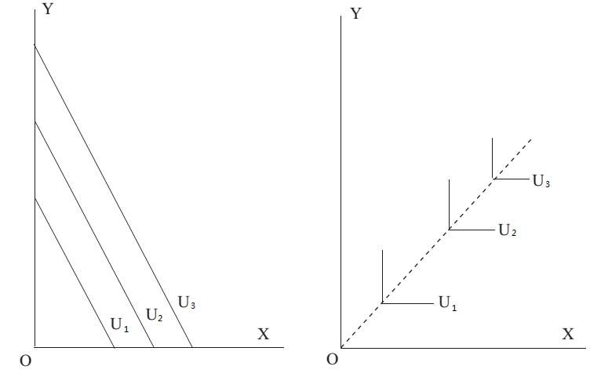

# Section 3: Indifference Curve

With the concept of use value (utility), we can go back to solve the problem of ranking the different baskets of goods. Looking back at the fig.10-1 in section 1, each point in the rectangular coordinates is a unique basket of good X and Y, and one can rank these points (baskets of goods) by their use values to him. If he thinks that the use values of the baskets represented by points of B and C are the same, a curve called “indifference curve” can be drawn to through them. Similarly, two other indifference curves can be drawn through point A and D respectively. So the fig.10-1 in section 1 is turned to fig.10-2 here.

Indifference curve has four crucial properties.

(1)	Difference curve has negative slope, which means it is a curve sloping downwards. As shown in Fig.10-2, since point A is preferred to D, a curve passing through these two points and sloping upwards cannot be an indifference curve. Because both X and Y are goods of which more is preferred to less, it is necessary to decrease the quantity of the other good, when the quantity of one good increases and the use value of the basket muse be kept unchanged. In other words, the points with the same use value must move along a curve where the quantity of one good increases and that of the other good decreases. It means the slope of this curve must be negative.

  

Figure 10-2

(2)	Indifference curves never intersect, which can be proved by reduction in mathematics. Assume tentatively that two indifference curves such as U1 and U2 do actually intersect at point A in Fig.10-3. Points A and C are both on U1, which means the consumer is indifferent between them. Points A and B are both on U2, which means the consumer is indifferent between them. By the axiom of transitivity, the consumer must be indifferent between B and C, which means they should be on the same indifference curve, but in fact they are not. So the initial assumption is invalid, and indifference curves cannot intersect.

  

 Figure 10-3

(3)	The use values of points on the same indifference curve are the same, but the use values of points on different indifference curves is certainly different. How to determine which one has higher use value? The answer is: the indifference curve farther away from the origin has higher use value. The proof is as followed: As shown in fig.10-2, it is obvious that the indifference curve through point A is farther away from the origin than the curve through points B and C, while the indifference curve through point D is closer to the origin than the curve through points B and C. Because point A is preferred to points B and C, the indifference curve through A, which is farther away from the origin, has a higher use value. In contrast, both points B and C are preferred to point D, so the indifference curve through B and C, which is closer to the origin, has lower use value.

The use values of points on the same indifference curve are the same, but the use values of points on different indifference curves is certainly different. How to determine which one has higher use value? The answer is: the indifference curve farther away from the origin has higher use value. The proof is as followed: As shown in fig.10-2, it is obvious that the indifference curve through point A is farther away from the origin than the curve through points B and C, while the indifference curve through point D is closer to the origin than the curve through points B and C.  Because point A is preferred to points B and C, the indifference curve through A, which is farther away from the origin, has a higher use value. In contrast, both points B and C are preferred to point D, so the indifference curve through B and C, which is closer to the origin, has lower use value.

(4)	Indifference curve is convex to the origin. According to (1), indifference curve must be sloping downwards. The indifference curves in left and right panels of Fig.10-4 are both sloping downwards, but the shapes are different. The one in the left panel is convex to the origin, while the one in the right panel is concave to the origin. The one in the left panel is based on the well-established empirical principle of “diversity in consumption”, while the one in the right panel comes from “unity in consumption”.

  

Figure 10-4

We can choose two points A and B on the indifference curve of U1 in both panels of Fig.10-4, and connect these two points with a straight line, then take the middle point C through which draw another indifference curve of U2 tangent to the line AB. It is clear that use value represented by U2 is higher than U1 in the left panel, while lower in the right panel. Obviously, the quantity of two goods in point C is more balanced than that in points A and B. The straight line connecting points A and B is (relative) price line for the two goods, which will be explained in the later section. The left panel means that at a certain price, people think it is better to consume the two goods in a balanced way (represented by point C) than in an extreme way (represented by point A with too much Y and point B with too much X). In contrast, the right panel means that at a certain price, people think it is better to consume the two goods in an extreme way than in a balanced way. The left panel is supported by people’s consumption behaviors in reality, so indifference curve should be convex to the origin.

In Lecture 8, complements and substitutes have been introduced, and their indifference curves are drawn in the left and right panels of Fig.10-5 respectively. The indifference curve of perfect substitutes is a straight line, while that of perfect complements is a right angle. Most of goods in reality are between these two extremes, so the indifference curve of two goods is generally a curve convex to the origin.

  

Figure 10-5

