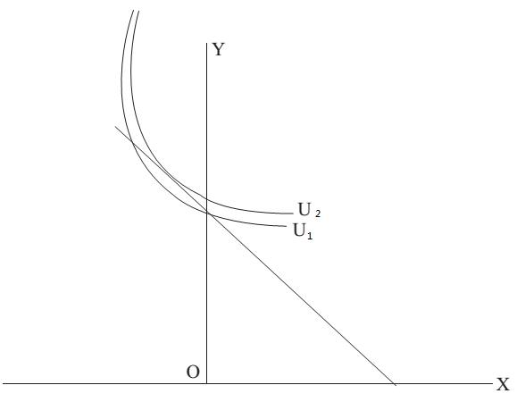

# Section 4: The Optimum of the Consumer

In the above sections, only the postulates of consumer theory on human’s intentions or preferences are discussed. In order to further find the optimum of the consumer or the consumption equilibrium, constraints must be included. Indifference curves only provide the following information: the consumer is indifferent to some points (baskets of goods) which are on the same indifference curve, and the further away from the origin, the higher the use value the indifference curve represents. Due to the human’s nature of self-interest, if there are not any constraints, the consumer will choose countless points on the indifference curve that is infinitely far from the origin. Obviously, such an answer is meaningless and does not help to infer the consumer’s behaviors.

  

Figure 10-6

Next we will introduce the “Budget Line” which is used to reflect the constraints faced by the consumer. The straight line through the points A, E and B in Fig.10-6 is the budget line, which is drawn according to the equation of PxX + PyY = I. The economic implication of the budget line is that the consumer is faced with two constraints: income and price (the relative price of X and Y). If there were no constraint of income, the consumer could buy whatever he wants, so he would not need to choose. With the restrictions of “self-interest” and that “more is preferred to less”, he could consume infinite quantities of both goods. Or even though his income is limited, but if the goods were free, the limited income would not be a constraint, and the consumer could also consume infinite quantities of both goods. Only when his income is limited and he must pay a price to buy the goods, need the consumer think about the following questions: how should I allocate my limited income to buy different goods for consumption, which is optimal to me? According to the analysis on preference in previous sections, the optimum of the consumer is to maximize the use value (utility), which is the implication of self-interest, under the constraints of income and price.

Let's look at the geometric solution first. As shown in Fig.10-6, the budget line and the indifference curves are drawn in the same rectangular coordinate. There are three kinds of relationships between the indifference curves and the budget line: intersection (e.g. U1), tangency (e.g. U2) and separation (e.g. U3). Obviously, the indifference curve of U3 is the farthest from the origin among the three curves, representing the highest use value and is most preferred by the consumer. However, it is a pity that it is not attainable for the consumer, because it is separated from the budget line, the economic implication of which is that every point on it cannot be affordable by this consumer under the constraints of his income and the current relative price of good X and Y. Everyone wants to live in a luxury villa, enjoy the delicacies and expensive food every day, and take a cruise to travel around the world, which is precisely represented by the indifference curves separated from the budget line such as U3 that is too good to be affordable.

For the other two indifference curves, the arc from point A to point B of U1 represents the baskets of goods that is affordable by the consumer, but this curve is the nearest to the origin among the three ones, which means that the use value it represents is also the lowest, so the consumer is not interested in it. The rest is the indifference curve of U2, and there is only one point on it that is affordable by the consumer can afford, which is point tangent to the budget line. One point is enough, and it is exactly the optimum of the consumer, because it is the only basket of goods that is affordable by the consumer on the farthest indifference curve from the origin that is attainable for the consumer under the current constraints.

Then let’s turn to the corresponding algebraic solution. Since the geometric solution is the tangent point of the indifference curve that is tangent to the budget line, the algebraic solution is to find where the slopes of them are equal. The budget line is a straight line with the equation of PxX + PyY = I ,so the slope of it is $\frac{Px}{Py}$ , the relative price of the two goods. How about the slope of the indifference curve? According to calculus, the slope of a curve is the derivative of $\frac{dy}{dx}$, which is called the “marginal rate of substitution in consumption” (MRSc) in economics. The economic implication is that if the use values of the basket of these two goods keep unchanged, when the consumption of one good is increased, it is necessary to reduce the consumption of the other good, which means the substitution of the consumption of the other good with that of one good. Thus, $\frac{Px}{Py} = \frac{dy}{dx}$ is the algebraic solution to the optimum of the consumer.

The geometric and algebraic solutions mentioned above are both “interior solutions” in mathematics, but there are also “corner solutions”. In Fig.10-7, the indifference curve of U2 is tangent to the budget line in the negative domain, which obviously could not happen in reality. Therefore, the consumer can only choose U1 as the second best choice, because it is the farthest one from the origin (and the closest one to U2) among all the indifference curves that intersect the budget line in the positive domain. The intersection point of U1 and the budget line is the same intersection point of the budget line and the vertical axis, the economic implication of which is that this consumer will spend all his income on good Y, and does not buy any good X at all. In reality, there are a large number of goods that a consumer does not buy at all, such as luxury villas, global tourism which are too expensive, as well as the goods which are very cheap with extremely poor quality, and the goods which are of no use to himself (such as a novel written in Malagasy). They are all the examples of good X in this Figure. By the way, it is necessary to have a broad understanding of good X and Y. For example, X in the corner solution can be regarded as all the goods the consumer does not buy, while Y can be regarded as all the other goods he will buy more or less. Thus, it is not unrealistic for this model of two goods.

  

Figure 10-7

Attention: there is a constraint implied in the above analysis of the optimum of the consumer that there is no borrowing or lending in the world simulated by this model. In reality, people will not spend all their incomes now, which is usually not the optimum. They will choose between present consumption and future consumption, which will be analyzed by the interest theory in the later lecture. Now it is supposed that the present income must be spent completely at present, or else it will rot and lose its value in the future (imagine that this income is represented by fresh fruits and vegetables), so there will be no borrowing and lending in the word, which means you cannot lend the present income to others for his present consumption in exchange for his repayment to you in the future for your future consumption. And the current consumption cannot exceed the current income either, because you cannot borrow other’s present income for your present consumption.

