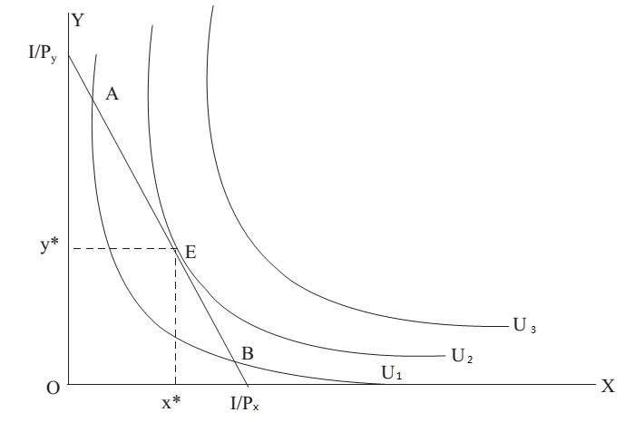

# Section 6: Are there Giffen Goods?

Just as for the Engel curve derived from IEP, when income rises, the quantity of good X will rise (superior good) or fall (inferior good); for the demand curve derived from PEP, when price rises, the quantity of good X will fall or rise. However, the latter is not in line with the law of demand!

Fig.10-12 illustrates how such a case that is not in line with the law of demand happen geometrically. Here is the economic implication. There are actually two kinds of effects for a price change: one is substitution effect, the other is income effect.

Substitution effect means when the price of a good rises, people will change to consume its substitutes. Under the constraint of constant income, all goods are substitutes, because if one wants to buy more of one good, he has to buy less of the other good to free up income.

  

Figure 10-6[^1]

Income effect means when the price of a good rises, people’s real income falls with other factors unchanged, which will cause people increase or decrease the consumption of the good. Suppose one’s income is RMB1000, and the price of a bottle of water is originally RMB1. If he spends all his income on water, he can buy 1000 bottles of water. Then the price of a bottle of water rises to RMB2, he can only buy 500 bottles of water now, which is the same as if the price of a bottle water keeps RMB1 while his income falls to RMB500. Therefore, a rise in the price is similar to a fall in income. The purchasing power of monetary income is called real income in economics. For example, when the price of a bottle of water is RMB1, the real income of RMB1000 is 1000 bottles of water. So when the price of a bottle of water is RMB2, the real income of RMB1000 falls to 500 bottles of water. Thus, changes in the price of a good will cause changes in real income.

The substitution effect is based on the premise that “real income remains unchanged”, then it can be separated from the income effect, and it is easy to understand why there would be cases that are not in line with the law of demand. The price and quantity in the substitution effect must change in the opposite direction, which is determined by the postulate of self-interest. However, the price and quantity in the income effect do not necessarily change in the same direction. In the case of inferior goods, they change in the opposite direction. Thus, when the price of inferior goods rises, the substitution effect leads to a decrease in quantity. However, a rise in the price is equivalent to a fall in real income which causes the consumption of inferior goods to fall. As long as the income effect exceeds the substitution effect, there will be a rise in the net change of quantity.

This kind of goods that is not in line with the law of demand is called “Giffen Goods”, because it is a British knight named Giffen who firstly proposed this possibility to Marshall when he revised his “Principles of Economics”. Marshall wrote it down in his book and named it after him. In fact, Giffen had never seen such Giffen goods with his own eyes, but just proposed such a possibility in logic, and gave an imaginary example of Irish peasants’ potatoes. Irish peasants were so poor that their income came mainly from the sale of potatoes and they also mainly fed on potatoes and a little meat. If there were a serious crop failure of potato in a year, the price of potato would rise dramatically, but the income of Irish peasants would drop dramatically. Although the price of potato rose, the production quantity of potato fell even more, so the income still dropped. These poor peasants could not afford even a little meat which was substituted by more potatoes, so the price of potato rose and it seemed to be not in line with the law of demand.

This imaginary example of Irish peasants’ potatoes proposed by Giffen has mistakenly become a fact that he had really seen. The following reading material “Was Bread a Giffen Good?” is about the investigation by the economic historian to see if the bread of English rural laborer household which is similar to the potatoes of Irish peasants was a Giffen good. The result of it shows that bread was not a Giffen good. In fact, No economist has found any Giffen goods in reality so far.

> READING MATERIAL: WAS BREAD A GIFFEN GOOD?[^2]
>
> Some historians have suggested that bread was a Giffen good for English rural laborers at the end of the eighteenth century.
>
> A study by Roger Koenker casts doubt on this claim. [^3] In the late eighteenth century, the limited transportation network in Britain meant that prices differed considerably across communities. These differences, as well as changes over time, provided data for estimating the demand for bread.
>
> The demand function of a typical English rural laborer household was estimated as follows:
> 
> Quantity of bread = 0.40 + 0.41 Family size + 0.024 Weekly expenditures−0.35 Bread price + 0.57 Meat price
>
> Here bread quantity was measured in loaves per week, bread price in pence per loaf, and meat price in pence per pound. Weekly spending (in pence per week) was used as the measure of overall income.
>
> The negative coefficient (−0.35) for bread price shows that bread was not a Giffen good for these consumers. Indeed, the positive coefficient for weekly spending (income) suggests that both bread and meat were normal superior goods. (As the text showed, although an inferior good can be a Giffen good, a superior good cannot be.) The positive coefficient on the meat price means that an increase in the price of meat increased consumption of bread, suggesting that bread and meat were substitutes. Consumers, buying less meat in response to the higher meat price, bought more bread.

As mentioned in Lecture 8, there was a debate in China about whether the law of demand had been refuted. At that time, a large number of people claimed to have seen Giffen goods which were not at all if closely examined. As can be seen from the above discussion, Giffen goods are strictly defined in economics. The goods with the consumption that appears to rise along with the rise in price are not defined as Giffen goods. They must be inferior goods firstly, and then the income effect must exceed the substitution effect. The higher the tuition (price) of an MBA degree is, the more people apply for it. The more expensive the luxury is, the more consumers buy it. The higher the stock price is, the more investors buy in ... These phenomena seem to refute the law of demand, but they cannot be regarded as Giffen cases. How likely are MBA degree, luxury, stock ... to be inferior goods which means people will consume less of them when they become richer? They cannot even satisfy the first requirement (inferior goods) of Giffen goods.

However, despite the above ignorant arguments, there are still following questions in economics: are there Giffen goods in reality? Has the law of demand been refuted by Giffen goods? There are three levels of answers to these questions.

The first level of answer: from the perspective of mathematics (geometry), there do logically be Giffen goods. Therefore, the law of demand cannot be deduced from consumer theory, unless it is supplemented with the supposition that there are no Giffen goods.

The second level of answer: from the perspective of reality, there cannot be Giffen goods. The reason is very simple. Although there are inferior goods in reality, it is almost impossible for the income effect to exceed the substitution effect. One needs to consume thousands of goods, so the expenditure of one good accounted for the proportion of his total income cannot be very high, and the income effect caused by the rise in the price of it is negligible, basically cannot exceed the substitution effect. Even for high-priced commodities such as real estate, they are bought through long-term savings at one time, so the price is actually not so high if decomposed into the proportion of the income in each month, which is much easier to understand when houses are commonly paid by installment nowadays. What is more, houses are seldom inferior goods, let alone Giffen goods.

Of course, it can be imagined that the extreme case such as the Irish peasants’ potatoes proposed by Giffen would really happen in reality. The income effect of the price change in potato would be strong enough to overwhelm the substitution effect. However, as long as Irish peasants’ income rose slightly, it were impossible to spend most of the income on one good. Moreover, the consumption of inferior goods would fall rapidly with the rise of income, so the impact of the income effect would also fall rapidly. Thus, there would be Giffen goods under so extreme circumstances that could only be imagined.

The third level of answer: from the perspective of market transactions in a society, there is impossible to be Giffen goods. If one would really buys more of a good when it is more expensive (the good is his Giffen good), others would raise the price of it to infinity and sell it to him. He would spend all his wealth on this good, and never sell it out again. In other words, Giffen goods will be eliminated out of the market by competition.

In conclusion, there are no Giffen goods in reality. Even there are, they are not important, and does not need to be cared about in economics. If it were not for MSE to deduce the law of demand with the more complicated consumer theory, but simply regard the law of demand as an axiom that needs no proof and only be accepted, the problem of Giffen goods would not be a problem at all!
- - -

[^1]: The consumption change from point P to C can be decomposed into the move from point P to S which is called substitution effect and the mover from point S to C which is called income effect. The former is called substitution effect because both points of P and S are on the same indifference curve, which reflects that income is constant, so there is no income effect. The substitution effect causes the consumption to rise from X1 to X2. The left panel is about the case of superior goods where the positive income effect causes the consumption to rise further from X2 to X3. In contrast, the right panel is about the case of inferior goods where the negative income effect causes the consumption to fall from X2 to X3, and it even exceeds the substitution effect, which causes X3 to be less than X1.

[^2]: This reading material is an excerpt from “Price Theory and Its Application”, P118.

[^3]: Roger Koenker, “Was Bread Giffen? The Demand for Food in England circa 1790,” Review of Economics and Statistics,v.59 (1977).
