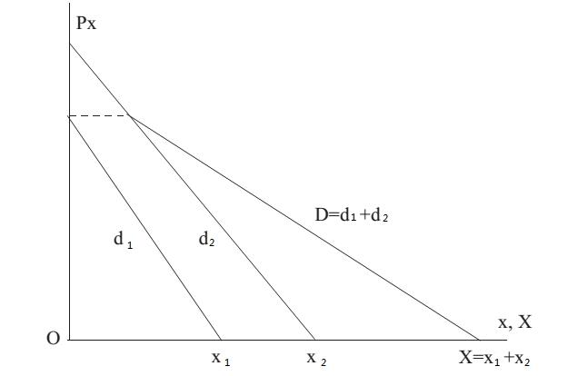

# Section 7: From Individual Demand to Market Demand

The demand curve mentioned before is the individual demand curve, while the market demand curve of a certain good shows the aggregate quantity demanded by ball consumers together for it, and is obtained by summing the individual demand curves horizontally, as Fig.10-13 illustrates.

Note that Fig.10-13 is only applicable to illustrate the “Private Goods”. If it is the market demand curve of a Public Good, it should be obtained by summing the individual demand curve vertically. The characteristics of public goods are non-exclusive and non-competitive in consumption, which means the same public good can be consumed by more than one person without interfering with each other.[^1] For example, if one eats an apple, others are not able to eat it again, so apple is a “private good”. By contrast, if one is listening to a song, others can also listen to it, so song is a “public good”. Because the consumption of a public good is non-exclusive, the total demand of it cannot be obtained by summing all the individuals’ demands, but the total income of it can be obtained by summing the prices paid by all individuals. For example, a song can be supplied to countless audiences, and the producer does not need to increase the quantities as more and more listen to it. By contrast, the producer of apple needs to increase the quantities supplied as more and more want to buy. Therefore, the income from this song is summation of the prices paid by all the audiences. That is why the market demand curve for public goods is obtained by summing the individual demand curves vertically, which means summation of the prices, instead of horizontally, which means summation of the quantities.

  

Figure 10-13

The non-exclusive consumption of public goods not only affects the market demand curve, but also makes it more difficult to protect the PPRs of public goods than private goods, which will be explained in detail later in this book.

- - -

[^1]: Caution: do not confound public goods with common goods which are without PPRs or public utility supplied by government. Public goods can be owned and supplied by private individual.
