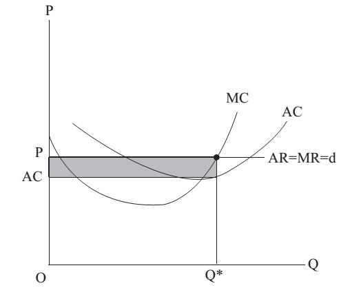

# Section 2: The Optimum of Producers

When the postulate of self-interest is applied to the theory of firm, the problem of equilibrium or optimum is how a producer chooses the appropriate outputs to realize rent maximization.

Mathematically, it is to seek the extreme value of R－C (the difference of revenue and cost), which is to find the derivative of it to be 0 (i.e. (R－C)’＝0 or R’ ＝C’. Derivative is a marginal magnitude in economics, so this formula can be rewritten as MR＝MC, which is precisely the optimum for producers. It is universally applicable, not only to price-taking discussed in this lecture, but also to the price-searching to be discussed in the next lecture. It is actually a specific form of the third extended application of marginal analysis (equal marginal principle) mentioned in Lecture 7.

The above is from the perspective of mathematics to explain the optimum of producers, while the following is the economic implication.

For a producer, if he produces and sells one more unit of output, on the one hand he can obtain more revenue (marginal revenue or MR), but on the other hand he has to pay more cost (marginal cost or MC). If MR＞MC, it means the production of this unit of output is worthy, because it increases the total rent. Thus he will choose to produce one more unit of output, which implies that he has not reached the optimal output, and should continue to expand the production scale.

However, if he produces and sells one more unit of output and finds MR＜MC, it means the production of this unit of output is a loss, because it decreases the total rent. Thus he will not produce more, but may consider if he should cut one unit of output instead. If he does so, on the one hand his revenue will fall, but on the other hand he can also save some cost. Because now MR＜MC, it is worthy to cut one unit of output, which increases the total rent. Thus he will choose to cut one unit of output, which implies that he has produced too much and exceeded the optimal output, and should reduce the production scale.

In a word, when MR＞MC, the output is less than optimum. And when MR＜MC, the output is more than optimum. Only when MR＝MC, can the output be optimum, because now a more (or less) unit of output leads to the same additional income and additional cost, which means the total rent will neither increase nor decrease, and actually has reached the maximum.

Specifically in the market structure of price-taking, since a producer can only passively take the prices prevailing in the market and the market price will not change no matter how many outputs he sells, the average revenue (AR) and marginal revenue (MR) are both equal to the market price (P), which is shown in Fig.15-1 where AR, MR and the demand curve (d) that the producer faces are the same flat line.

  

Figure 15-1

