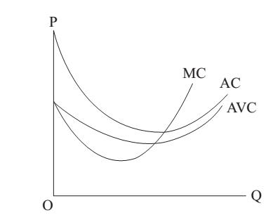

# Section 3: The Law of Diminishing Marginal Product

As for cost, there are also average cost (AC) and marginal cost (MC). As shown in Fig.15-1, AC is a u-shaped curve, while MC is also u-shaped that passes through the bottom of the AC from below. In MSE, there is a u-shaped curve called average variable cost (AVC) which is shown in Fig.15-2 and is located below the AC and the bottom is also passed through by the MC.

For these three curves of cost in MSE, there are some questions.

  

Figure 15-2

(1) Why is MC curve U-shaped or why does MC decrease first and then increase?
The answer is “the Law of Diminishing Marginal Product”, also known as “the Law of Diminishing Return”. It is an iron law, which means it must be true. This law says, as long as one of the production factors is fixed, as the inputs of other factors increase, the total output will increase at the beginning, but finally it will turn to decrease. Because the increase in total output (i.e. marginal product) will gradually decrease, eventually total output will turn to decrease when marginal product has already decreased to a negative value.

The law of diminishing marginal product can be proved by reduction to absurdity. If this law does not hold, people can grow enough food for the entire world in a flowerpot. The size of the flowerpot holds constant the amount of soil which is one of the production factors. Continuous watering and fertilization in the flowerpot can initially increase the total output, but after a certain point, the total output will increase more and more slowly and eventually turn to decrease. Biology tells us that too much water will drown the plant and too much fertilizer will burn the plant to death. While economics tells us that there is an optimal ratio of various production factors. Once the optimal ratio is exceeded, on the one hand the redundant will not increase output, and on the other hand they may even hinder production and lead to a drop in output. Therefore, even if all production factors increase, but one of them does not increase proportionally or increases more slowly than the others, the law of diminishing return will also work. If there were no the restriction of this law, producers would choose to expand production endlessly, which has never been observed in reality, so this law is an iron law.

Strictly speaking, the law of diminishing product is not an economic theory, but a natural law which is also applicable to natural science. However, the constraint of transaction cost can be added to make it significantly important in economics. Before, the constraint of transaction cost is added to amend the traditional theories in MSE. While this law of diminishing marginal product has never been refuted by facts, and the complementation of the constraint of transaction cost further strengthens its conclusion.

There is an ancient Chinese saying “one monk carries water by himself, two monks cooperate to carry water, and three monks have no water”. In the production of “carrying water”, the production factors are labor (monks), two buckets and a pole. When there is only one monk, he uses a pole to carry two buckets by himself. Due to his limited strength, the water in the buckets is only half full, and he can only walk back and forth for once. When there are two monks (the input of labors increases), they can change the mode of production, from one person carrying the water by himself to two persons cooperating to carry the water, so they can fill the buckets with more water and walk back and forth for more times and increase the total output. In other words, the increase of input of production factors enables producers to choose some more efficient production mode (technology), thus increasing output.

However, when there are three monks, the additional monk will do no good to increasing output. With only one pole and two buckets, three persons can not cooperate to carry more water than two persons, but only hinder each other. If two of them carry the water first, and then the third one cooperates with one of them to carry the water next time, there is always one monk who is idle and does no good to output increase. That is why even the total output will increase, but the increase (i.e. marginal product) will be less than that of the input of labor increasing from one monk to two monks, which is precisely the implication of the law of diminishing of marginal product.

Taking the implication of this Chinese saying into account, one more monk will make it more difficult to cooperate with each other, which means the transaction cost will rise. When the input of labor from two monks to three monks, the transaction cost of cooperation increases to such an extent that no one is willing to carry water, and the total output falls to 0! The traditional law of diminishing marginal only considers factors of natural science, but if transaction cost is also taken into account, the effect of it will be further strengthened.

When the decreasing part of the marginal product curve is multiplied by the price of product, it will become the demand curve of production factors. Since no producer is so stupid to stop expanding production at the increasing part of the marginal product curve, the meaningful demand curve for production factors must be sloping downwards, which is not conflict with the law of demand.

Suppose the production factor is labor (L) and the price of it is W, then

$$MC = \frac{dC}{dq} = \frac{WdL}{dq} = W∙ \frac{dL}{dq} = \frac{W}{\frac{dq}{dL}} = \frac{W}{ML}$$

Thus, the shape of the marginal product curve is directly related to that of the marginal cost curve, except that the former is inverted U-shaped, while the latter is U-shaped, and the law of diminishing marginal product translates into the law of rising marginal cost.

(2) Why is AVC curve U-shaped?

In MSE, there are production costs of short-run and long-run. In short-run, there are fixed cost and variable cost, while in long-run there is not any fixed cost. AVC here is an average magnitude by dividing variable cost (VC) by output. As has been criticized in Lecture13, fixed cost in MSE is a wrong concept because it is in essence historical cost which is not (opportunity) cost in economics, and should be replaced by the concept of overhead cost. While the concept of variable cost (VC) should be changed to direct cost (DC), so AVC should be also changed to Average Direct Costs (ADC), and there should not be difference of short-run and long-run.

According to the law of diminishing marginal product, and adding the constraint of transaction cost, ADC curve will be U-shaped, and MC curve will pass it through the bottom, which has been shown in Fig7.2 of Lecture7.

