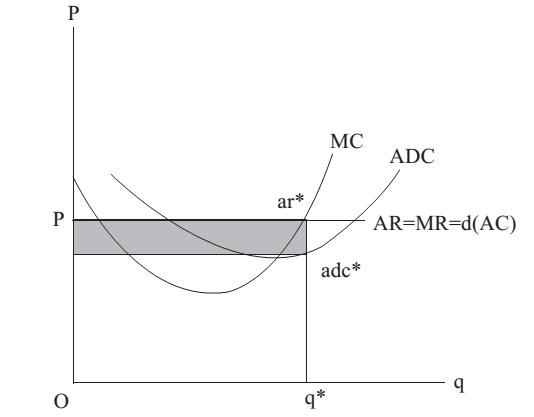

# Section 4: Average Cost

(3) Is AC curve U-shaped?

Since in MSE, there are production costs of short-run and long-run, there are also AC curves of short-run and long-run accordingly, which is, of course, wrong. Even if there were long-run AC curve, it could not be U-shape, but a flat line. Why? Because the so-called long-run means that no production factor is fixed, or the law of diminishing marginal product does not apply now, but the so-called “Returns to Scale” is applicable. In MSE, there is no law about returns to scale, and three cases are all possible: diminishing returns to scale, constant return to scale, and increasing returns to scale.[^1] However, Friedman pointed out incisively in his “Price Theory” that with the assumption of equal proportion change of all production factors, logically only the constant returns to scale is possible and the other two cases are both impossible.

Here is Friedman’s analysis. Suppose Paris’s subway system is expanded as twice as before, can the passenger capacity be also doubled? The intuitive answer is impossible, and the passenger capacity should increase less than twice, because the expansion of the subway system will make the underground in Paris more crowded and there will be not enough demand from the population and business activities. In other words, it seems that the diminishing returns to scale will apply to this question. However, it is only because the underground space, population and business activities in Paris have not been expanded as twice as before, which means not all production factors increase by equal proportion, and it is conflict with the assumption of returns to scale. Just imagine all production factors really increase by equal proportion (even the air is doubled), it is equivalent to crone another Paris, and the passenger capacity of the subway will of course be as twice as before. Thus, only the constant returns to scale is possible, which is always true, and in fact a tautology.

However, if we get rid of the wrong division of short-run and long-run in MSE, producers can only determine ADC and MC. There is no marginal magnitude for overhead cost, because there is overhead cost even without production. There is only one kind of AC, regardless of short-run or long-run, but it is determined by the market price. The income of a producer obtained from the market should be deducted direct cost, and the rest is overhead cost. The income divided by output is the market price, while the total cost (the sum of direct cost and overhead cost) divided by output is AC, so AC is equal to the market price. In other words, the demand curve faced by a producer is precisely his AC curve! Thus, AC curve is a flat line in the market structure of price-taking, and a line sloping downwards in the market structure of price-searching, and both are not U-shaped. However, on AC curve, what is really meaningful is only the point corresponding to the optimal output (satisfying the equilibrium condition of MR＝MC), and it is not necessary to draw the whole AC curve.

The AC curve is always the same as the demand curve, which means P＝AC. There may be a profit more than the expected income ex post, which is not opportunity cost. In fact, taking into account all opportunity costs (whether it is overhead cost as rent or transaction cost), there can not be the so-called “profit” or “supernormal profit” calculated by P－AC in MSE, which is the implication of the “zero-profit theorem”. In MSE, this theorem says, “In the long run, (economic) profit for any firm in a competitive industry is zero.” There are two major mistakes in it. Firstly, there is no need for the wrong division of “long run”. Secondly, there is no need for the restriction of “competitive industry” (i.e. the market structure is price-taking). The correct zero-profit theorem should be: Profit for any producer in any market (whether it is price-taking or price-searching or so-called monopoly) is zero. In MSE, it is believed that there is supernormal profit for the so-called monopolist, which in fact is monopoly rent. Rent is in essence cost, not profit. It will be explained in detail in the next lecture.

The implication of zero-profit theorem is that in reality, there is the same so-called (accounting) profit rate for all producers in all kinds of industries. Suppose there only two industries A and B in an economy. When one engages in industry A, he has given up the income from engaging in industries B, so the profit of B is the opportunity cost of engaging in A. If his profit is lower than that in B, he has suffered a loss, and he will turn to B. If his profit is higher than that in B, the producers in B have suffered a loss, and they will turn to A. In other words, the profit for all producers in all kinds of industries must be the same, or else producers will compete to leave the lower-profit industry and enter the higher-profit one.

In fact, this same profit rate is the rate of return on investment (ROI), which appears as the market interest rate for loaning. People will compare the market interest rate with the profit or rate of ROI in their own industries. If the profit is lower than the interest rate, they would better shutdown their business and deposit the money in the bank. If the profit is higher than the interest rate, they will borrow the money from the bank to do business for this supernormal profit.

Some may argue, there is obviously higher profit in some industries or firms. There can be three reasons. Firstly, it may be the rent that is mistaken for profit. Some have unique vision or shrewd tactics, so their income is far higher than that of the ordinary. It is the return (rent) on their human assets of vision or tactics. Secondly, it may be due to administrative monopoly. The supernormal profit is still rent, but it is monopoly rent, which will be explained in the next lecture. Thirdly, it may be an industry with high risk, so the seemingly extraordinarily high profit is actually a “Risk Premium” to compensate those who bear high risk.

  

Figure 15-3

Venture Capital (VC) is the most typical example. A successful VC may have tens of thousands of times of returns, but the vast majority of VC will lose all the investment. This financial innovation, originally born in Silicon Valley, was once regarded “profiteering” and was heavily taxed by the Ford and Carter Administration of US, which led to a sharp drop in the amount of VC during those years. Fortunately, it was not long before Reagan became the President and reduced the tax rate a lot.

According to the above analysis, there is following mistake in the previous Fig.5-1: the AC curve should be ADC curve (AVC curve in MSE) as shown in Fig.15-3. The correct AC should be the flat line that coincides with AR, MR and the demand curve, but what is meaningful is only the point corresponding to q\* (i.e. ar\*). According to MR＝MC, the producer’s optimal output is q\* determined by the intersection of MC and MR. The point of adc\* corresponding to this optimal output is located below the point of ar\*, so the shaded area of (ar\*-adc\*)×q\* is the rent or overhead cost.

- - - -

[^1]: Cautious: do not confuse the “diminishing returns to scale” with “the law of diminishing returns”. The former applies to the so-called long-run case which means all production factors are variable, while the latter applies to the so-called short-run case which means there is at least one of production factors is fixed.