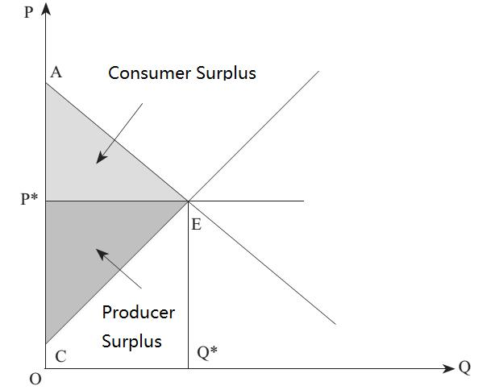
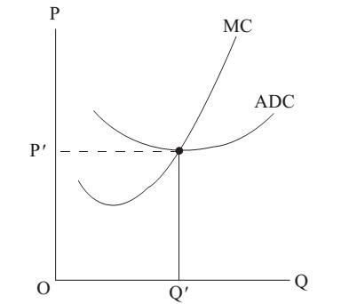

# Section 6: Consumer Surplus and Producer Surplus

If the demand curve and supply curve are drawn in the same diagram, it represents the theory of supply and demand already introduced in Lecture 9.

Now it can be explained more deeply. What does the demand curve in Fig.15-4 actually represent? A point on the demand curve represents the use value of that unit of good for the consumer, and is also the highest price he is willing to pay for it. Remind the concept of use value in Lecture 10, one is willing to pay a price for a good because it is useful and valuable to him. How much is one willing to pay for the good? The answer is: he is willing to pay a price not higher than the use value of the good for him. The use value of a good will decrease when the quantity of it increases, which is called “the Law of Diminishing Marginal Utility” in MSE. As mentioned in Lecture 10, the concept of utility should be replaced with use value, so this law should be also renamed as “the Law of Diminishing Marginal Use Value”, which seems similar to “the Law of Diminishing Marginal Product”. It is true that they are logically symmetrical, except that the law of diminishing marginal product is an iron law faced by producers, while the law of diminishing marginal value is used to describe consumers’ behaviors.[^1]

  

Figure 15-4

The law of diminishing marginal use value can be proved by the following example: when one is hungry and starving, and there is a piece of bread, how much is he willing to pay for it? Obviously, even if he must give up everything he has to buy the bread, he is willing to do so, because the use value of the bread is equivalent to his life. Without the bread, he will starve to death, while without his life it is meaningless to have much money.

However, when he has had this piece of bread, and there is another piece of bread, how much is he willing to pay for it? Because he has already had the previous piece of bread and is not as hungry as before, he is not willing to pay as much money as before.

When there is a third piece of bread, he is willing to pay further less for it. The use value of each new piece of bread offered to him will become lower and lower. After a certain point, he will even have too much bread and no longer feel that he is enjoying delicious food, but that he is fed up, which means the use value of a more piece of bread has fallen to negative for him. It is precisely why the demand curve is sloping downwards, which is actually due to the law of diminishing marginal use value.

In the market structure of price-taking, no matter how much a consumer buys, the market price is the same. The postulate of self-interest implies that the optimum for a consumer is to buy until the use value of the last unit is equal to the market price (i.e. point E in Fig.15-4). If one buys a unit more than E, the use value of this last unit of good or the marginal use value is less than the market price value which is the cost of this last unit of good or the marginal cost. In other words, the optimum or equilibrium for consumer is “marginal value＝marginal cost” (MV＝MC). For a consumer, the use value of a good is the non-monetary revenue from consuming the good, so the above equation can be generalized as “marginal revenue＝marginal cost”, which is precisely the same as the optimum or equilibrium for producer. As mentioned in Section 2, MR＝MC (equal marginal principle) is universally applicable.

Before the equilibrium point E, the use value of each unit purchased by a consumer is higher than the market price P he pays, so there is surplus for the consumer. If producer charges a higher price, the consumer is still willing to pay because before the last unit of good, the highest price he is willing to pay is higher than the market price. In the next lecture some pricing arrangement for producer to charge higher price will be introduced. Compared with those cases, there does be surplus for consumer in price-taking. It is called “Consumer Surplus”. Sum up all consumer surplus of each unit of good, it is a triangle-like shadow enclosed by the vertical axis above the price and below the demand curve (if the demand curve is a curve, it is a curved triangle).

The above analysis can be similarly applied to producers. The supply curve of a good represents the lowest price a producer is willing to charge. The supply curve is sloping upwards, which represents the increasing marginal cost, because it is part of the MC curve. Once a producer enters the market, he will continue to produce until the marginal cost increases to be equal to the market price (point E in Fig.15-4) because before that point the market price (MR) is higher than the cost of producing a more unit of good (MC).

In the market structure of price-taking, before point E, the revenue of each unit of good (P) is higher than MC, so there is surplus for producers, which is called “Producer Surplus”. Attention: the cost here is direct cost, because only for direct cost there is marginal magnitude. Therefore, producer surplus is actually overhead cost! Sum up all producer surplus or overhead cost of each unit of good, it is a triangle-like shadow enclosed by the vertical axis below the price and above the supply curve (if the supply curve is a curve, it is a curved triangle).

In MSE, consumer surplus and producer surplus are used to explain that transaction is beneficial to both buyers and sellers (consumer surplus for buyers and producer surplus for sellers), and are used as tools to measure welfare. Therefore, they are widely used in welfare economics to judge government policies.

However, it is not really the importance of these two concepts. Producer surplus is actually overhead cost, the importance of which has been fully explained in Lecture 13, while the importance of consumer surplus will be fully explained in the next lecture about price-searching.

  

Figure 15-5

In Lecture 9, it has pointed out that the supply curve and the demand curve are actually the same, but what was analyzed then is the case without production, while now is the case with production. Is the above conclusion that the supply curve is a part of the MC curve conflict with the statement that the supply curve and the demand curve are the same? The answer is No! When there is no production, from the perspective of opportunity cost, the price of holding a good is to give up the alternative of selling it and holding the other good instead. Therefore, when the price of a good rises, if one continues to hold it instead of selling it, the cost of doing so rises on the margin, which is the marginal cost. In other words, even without production, a consumer’s demand curve for a certain good is his MC curve for the other good, and MC curve is supply curve.

The above is the supply curve of a single producer, and the derivation of the supply curve of the whole market is the horizontal summation of the supply curves of all producers in the market, which is the same as that of the demand curve. However, there is a complexity here that if only a producer increases his output, it is just like a drop of water falling in the sea, and there is no influence on the market. If a large number of producers or even all producers increase their outputs, it is completely different.

Firstly, the increase in supply (of products) in the product market will lead to an oversupply and a drop in price if there is no change in demand, which will make producers be not willing to increase supply.

Secondly, there will be a large increase in demand for production factors in the factor market, which may lead to an increase in price unless the relevant factors are also widely used in other industries, and the impact of the increase in demand in this industry is negligible. The price of production factors is the cost of producers, which means that the marginal cost will rise more than when only one producer increases his output.

In other words, when the supply curves of all producers are summed up horizontally, the marginal cost curve (supply curve) of a single producer will actually change, resulting in the supply curve of the market summed up horizontally by them also changing. Based on the analysis above, it should be steeper than before, which means producers are willing to supply more products only with higher price due to the rise in marginal cost. However, it is only one of the possibilities. The supply curve may also become flatter, which means the marginal cost of a single producer decreases instead. The former case is called “external diseconomy”, while the latter one is called “external economy”. The word “economy” here refers to cost savings that is the original meaning of it.

As has introduced in section 3, the curve of ADC (average direct cost) is U-shaped, which means when the output increases, the ADC of a producer decreases first and then increases. The former decreasing part of it is precisely “internal economy”, while the latter increasing part is “internal diseconomy”. The word “internal” here refers to the decrease (economy) or increase (diseconomy) of the ADC that is caused by the increase of the output (scale) of the producer (within the firm). In other words, the internal economy and the internal diseconomy represent that the ADC curve of the producer falls first and then rises.

By contrast, the external economy and the external diseconomy do not occur within a firm, but are caused by the expanding scale of the industry outside a firm, which may be that other producers have increased their outputs, or new producers have entered the industry, and has also led to the decrease (economy) or increase (diseconomy) of the ADC of the producer. In other words, external economy and external diseconomy represent that the whole ADC curve of the producer moves up or down.[^2]

How there is external diseconomy has been explained above by that the increase in output of all producers will lead to an increase in the price of production factors and so marginal cost. Next we will explain how there is external economy.

In China there are many specialized markets where there are a large number of producers of the same industry, which is called “Cluster”. Such a cluster of producers will make the competition extremely fierce. A buyer is easy to know the market condition by walking around in the specialized market, while a producer is difficult to take advantage of the information cost. Why would producers still like to cluster in the specialized market? It must be because the benefits producers can obtain from cluster far outweigh the disadvantages, or the external economy outweighs the external diseconomy.

What external economy does cluster can lead to?

Firstly, cluster can save information cost. The cluster of the products of the same quality can reduce the cost for consumers to judge the quality difference of them. In addition, it can also save advertising expenses. In the vicinity of my hometown, there is a well-known 10-kilometer-long road lined with all kinds of furniture shops. Although there are many famous shops, there are more little-known shops. If a small shop opens alone at a place where is far away from other furniture shops, it must spend on advertising to publicize the location of it and attract customers to visit. The cost of advertising or publicity is information cost. But if it opens on the furniture road, those who need to buy a large number of furniture will go straight there, and naturally see it there, so it can save the information cost of publicizing it.
Secondly, cluster can also benefit from the cost reduction brought about by specialization. Let us take the furniture road as an example. There are transport fleets independent of furniture shops to deliver furniture for customers, which save the cost for furniture shops. If a furniture shop opens alone at a place far away from the furniture road, it has to keep a fleet to deliver furniture to customers. If customers are required to transport furniture by themselves, and it is difficult to find a suitable vehicle, they will tend not to buy furniture there or will not buy large size of furniture.

There will be independent transport fleets on the furniture road because there are a large number of furniture shops to supply a lot of business, which is enough to support independent fleets that rely solely on transportation service instead of selling furniture. With the large scale, the cost of an independent transport fleet is lower than that of a fleet kept by a furniture shop, because it is specialization for the former and has comparative advantage in cost. It is obviously due to the large scale of the entire industry, rather than a certain firm.

In addition, a furniture shop on the furniture road can be more specialized than that opens alone, which means it can only sell one kind of furniture such as desks because other shops can sell other kinds of furniture such as beds. Customers usually need to buy both desks and beds. If a furniture shop opens alone, it must sell all kinds of furniture to attract customers, which not only leads to higher cost, but also makes less rich verities of each kind of furniture and reduces the attraction to customers.
Thirdly, cluster can also facilitate the producers in the same industry to cooperate with each other, thus reducing the transaction cost of cooperation. In China, firms are used to contract out some production to each other when they suddenly receive a large order with a tight delivery deadline. Obviously, if they are close to each other geographically, it is easier to cooperate in production which can be called “cluster in production”.

There are many specialized wholesale markets (such as Yiwu small commodity market) in China, which are cooperation in sales. Regular customers often do not bother to go through such a large market to look for the goods they need, but go directly to a store with which they have established long-term and good relationship and tell it their needs. The store may have not some of goods, and the owner will help the customer to phone to the other stores for them.

The convenience of cooperation brought about by cluster is the key to the strong competitiveness of Chinese manufacturing in the international market. When a Chinese producer competes for an international order with the rivals from other countries, it does not fight alone, but is supported by the production capacity of the entire industry cluster in its region. How can foreign producers have such strong competitiveness to fight against the entire industry in China? In China, producers in the same industry will compete with each other, and will also cooperate with each other. Through competition, only the fittest can survive in the market, while through cooperation, the fittest will survive better in the international market.

- - - -

[^1]: Since “utility” in MSE is a measure of consumer preference, the law of diminishing marginal utility is regarded as a psychological law.

[^2]: The increase in output within a firm leads to decrease first and then increase in the ADC (the point moves along the same ADC curve), while the increase in output of the whole industry outside the producer leads to decrease or increase in the ADC (the whole ADC curve moves downward or upward). It is logically the same as the quantity demanded change caused by price change (the point moves along the same demand curve) when other factors are unchanged, while the demand change caused by other factors change (the whole demand curve moves), which has been discussed in Lecture 8.