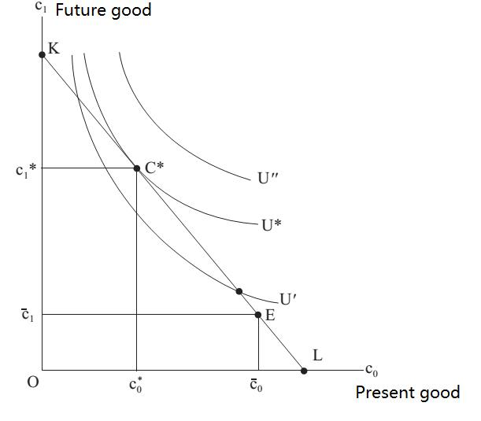

# Section 5: The Separation Theorem

As mentioned in section 1, there are two causes of interest. From the perspective of consumption, interest is determined by people’s subjective preference for time. From the perspective of production, interest is determined by a nation’s objective production capacity or efficiency. Some may wonder different persons have different time preferences, and how can interest be objective? The answer is: as long as the transaction cost of borrowing and lending is low enough, different people’s time preference (subjective interest rate) can be adjusted to be consistent with the objective interest rate in the market through borrowing and lending. It is logically similar to the fact that different people’s subjective preference for a good (marginal use value) can be adjusted to be consistent with the objective market price through buying and selling.

  

 Figure 18-1

Fig.18-1 is logically the same as Fig.10-6 in that the tangent point of the indifference curve and the budget line determines the optimum of consumption, and the horizontal axis is changed to present good and the vertical axis future good. The indifference curve reflects people’s preference for time. The slope of the budget line is the interest rate and passes through the initial endowment of wealth (point E). The optimum of consumption is point C\*, which means only part of the wealth is consumed now, and the rest is input for production to increase the income available for future consumption. By adjusting the present and future consumption, one can adjust his preference for time to be the same as the interest rate in the market, where is precisely the optimum (equilibrium).

The above is the case when there is no production, and the more general case when there is production is shown in Fig.18-2.

Fig.18-1 is logically the same as Fig.10-6 in that the tangent point of the indifference curve and the budget line determines the optimum of consumption, and the horizontal axis is changed to present good and the vertical axis future good. The indifference curve reflects people’s preference for time. The slope of the budget line is the interest rate and passes through the initial endowment of wealth (point E). The optimum of consumption is point C\*, which means only part of the wealth is consumed now, and the rest is input for production to increase the income available for future consumption. By adjusting the present and future consumption, one can adjust his preference for time to be the same as the interest rate in the market, where is precisely the optimum (equilibrium).

The above is the case when there is no production, and the more general case when there is production is shown in Fig.18-2.

The curve concave to the origin is called Production Possibility Curve (PPC). Usually, the two axes of PPC represent the output of two different goods, and the curve reflects all the combinations of maximal output that can be achieved when all resources are fully utilized in production. The shape concave to the origin reflects the law of increasing marginal cost (derived from the law of diminishing marginal product), which means along with the increase in output of the good on X-axis, the slope of PPC increases. In other words, the output of the good on Y-axis that must be abandoned also increases, or the opportunity cost to increase the output of good X increases.

In Fig.18-2, the two axes of PPC are replaced by the output of the same good in different periods, thus reflecting all the combinations of maximal output of present good and future good. The price line NN cannot be called budget line here, because it does not pass the point E representing the initial endowment, and does not reflect the income or wealth. The slope of NN only reflects the exchange ratio (relative price) of the X good and Y good, here is the interest rate because it is the exchange ratio of the present good and the future good. The tangent point of NN with PPC is the optimal production point (Q\*), while the tangent point of it with the indifference curve U’ is the optimal consumption point (C\*). As can be seen in Fig.18-2, Q\* and C\* is not the same point, which means that with the availability of loans the production decision and the consumption decision can be made independently. It is precisely the Separation Theorem.

  

 Figure 18-2

There are economic implications of this theorem.

From the individual’s perspective, the career choice does not affect consumption pattern although it does affect the income needed for consumption. For example, some like to save money for the future, some like use up all the income without saving, some like to consume the same amount money in different periods, and some like to sometimes consume more and sometimes consume less. All these different consumption patterns do not need different income patterns determined by different careers, as long as the career chosen can bring in the maximal wealth (the sum of the discounted values of all future incomes).

From the social perspective, the production of the whole society has nothing to do with individuals’ preferences for time. As long as the constraints of resources, technologies and constitutions are reduced as much as possible to maximize the production capacity or efficiency of the whole society, the social wealth can be maximized. The objective interest rate in the market is determined by the productive capacity or efficiency of the society, not by the subjective preferences for time of individuals.

Of course, there is transaction cost in reality, so requirements of the separation theorem cannot be fully met. For example, from birth to adulthood, a person basically has no income but he still needs to consume. According to the separation theorem, he can borrow money during this period until he can earn money when he works. However, since there is great uncertainty as to how much he can earn from his future work, which means there is very high information cost, usually no one will lend him any money. In order to solve this problem, there is morality that parents are responsible to bring up their children and children should be filial to their parents in human society. Parents with work pay their income for their children’s consumption when they are young and without work or income. And children pay back their income when they grow up and have work and income to support their old and retired parents.

In fact, it is in an implied loan contract where the PPRs of all parties involved are defined by blood ties and promoted by normality, so some of the transaction costs is much less than the explicit loan contract protected by laws. The binding force to ensure the execution of contract is weaker than the explicit one, so it can reduce some, not all, of transaction costs. However, the transaction cost of explicit loan contract is so higher when concluding a bargain that it is hardly possible to come to an agreement on such an explicit contract at all. Although the transaction cost of explicit contract is lower when executing, the overall transaction costs of the implicit contract of mutual support among parents and their children promoted by morality are lower than that of the explicit loan contract between strangers protected by laws. The reason is obvious why it is the former instead of the latter has been chosen to solve the problem that human need to consume much earlier than they can work and have income.
