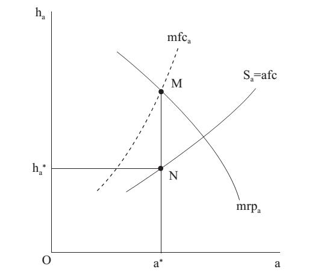
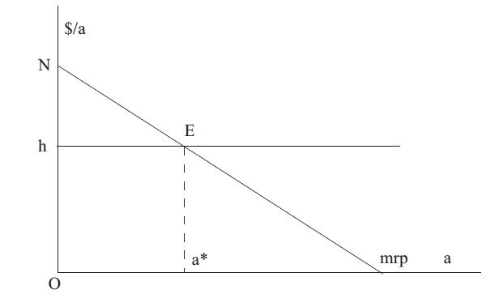
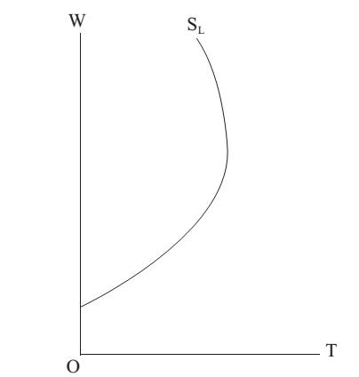

# Section 1: Income Distribution: Marginal Productivity Theory

Those who know the textbooks of MSE will notice that after the topics of producer theory and market structure, this book does not turn to introduce the factor market or turns from the resource allocation to income distribution, as the ordinary textbooks will do.

The reason has been explained before that there is no essential difference between factors (raw materials or intermediate products) and final products (consumption goods). Final products can be regarded as goods for consumption, and can also be regarded as raw materials or intermediate products used to produce labor as factors. In this lecture, it will be further explained that as long as the transaction cost is low enough and piece rate contracts are used, product market is inseparable from factor market. Thus, the analysis on product market can be analogized to factor market, so there is no need to elaborate on it, and to put forward some key points.

(1) The equilibrium of MR＝MC is universally applicable, not only to different market structures such as price-taking and price-searching, but also to factor market. When this equilibrium is applied to factor market, the specific form can be written as mrp＝h, where mrp refers to marginal revenue of product that means the increase in income brought about by an additional unit of production factor. In other words, mrp is an alternative form of MR, calculated by mp (marginal product) multiplied by P (price of product). As mentioned in Lecture 15, the curve of mrp is the demand curve of production factor, so the shape sloping downward is determined by the law of diminishing marginal product. And h is the price of renting production factor, so it is an alternative form of MC. The economic implication of this equilibrium is that the income (rent) obtained by each production factor is equal to the marginal contribution to production of it.

Why should the contribution be observed at margin? Because all factors have contributed to production, but how to separate the contribution of one factor? If only one factor is input to production without any other factors, it is even impossible to carry out production. However, if there are other factors input, the contribution of this one factor will be mixed with that of other factors. The solution is “Ceteris Paribus” that means keeping the input of other factors unchanged and only changing the input of this one factor, and then the increase in income (the mrp of this one factor) must be attributed to the contribution of this one factor (because other factors have not increased and cannot be the source of income increase).

There are some assumptions for the equilibrium of mrp＝h. Firstly, there is no monopoly in the product market and the price of product remains unchanged. Secondly, there is no monopoly in the factor market and the price (rent) of factor remains unchanged. Thirdly, the quantities of other factors are assumed to remain unchanged.

If the first two assumptions are relaxed, the analysis will become complicated, but only the specific form of MR＝MC is changed, which will not affect this equilibrium. For example, Fig.20-1 reflects the case when there is monopsony in the factor market. If compared with the Fig.16-1 (that reflects the case when there is monopoly in the product market) in Lecture 16, it is obvious that they are logically similar. The curve of MC in Fig.16-1 corresponds to that of mrp in Fig.20-1, while the curve of MR corresponds to that of mfc, and the cruve of AR (that is the same curve as D, the demand curve) corresponds to that of afc. The point H point in Fig.16-1 determines the equilibrium output (Qm), which corresponds to the point of M point in Fig.20-1that determines the equilibrium quantity of factor (a\*). The point of F in Fig.16-1 determines the equilibrium price of product (Pm), which corresponds to the point of N in Fig.20-1 that determines the equilibrium price of factor (h\*).

  

 Figure 20-1

Besides, if the price of product price and that of factors change, it is not necessarily because there is monopoly in these two markets, but it is also possible that there is external diseconomy mentioned in Lecture 15, which still only changes the specific form of MR＝MC.
If the third assumption is relaxed, the analysis will also become complicated, but what is important is that it cannot refute the law of demand for production factor, because it is guaranteed by the iron law of the diminishing marginal product[^1], unlike the law of demand for product as an axiom established by postulation.

(2) With the Euler Theorem in Mathematics, it can be proved that all the income obtained from the sale of product is divided up by all the factors in production, which means there is no “surplus value” as Marx said, and it is divided according to the proportion of the contributions of the factors.

Neoclassical economics usually divides production factors into capital and labor. Thus, there i s $Pq = mrp_L∙L + mrp_K∙K = wL + rK$, where W is the price of labor (wage rate), and r is the price of capital (interest rate). It is precisely the “Marginal Productivity Theory” which is the theory of income distribution advocated by neoclassical economics. Classical economics pays more attention to agricultural production, so there is also the factor of land, and the income of it is rent. However, as has pointed out in Lecture 12 and 18, if the concepts of rent and capital are generalized, the income of all factors is rent, and any good that can bring income is an asset, the market value of which is capital. In fact, labor is often also called human capital.

As shown in Fig.20-2, the curve of mrp (the demand curve of production factor) is sloping downwards, and the point where the price of factor (h) is equal to it determines the equilibrium quantity of factor (a\*). The price of factor price multiplied by the quantity of it is the income of it (the rectangular OhEa\*). NhE, the triangle (or curved triangle) formed by the curve of mrp above the horizontal line of price and the vertical axis is the consumer surplus mentioned in Lecture 15. Because it is the factor market, the so-called consumer is the producer who rents production factors, and the so-called consumer surplus is actually the rent obtained by the other production factors. The sum of NEa\*O and NhE is the total income (gross output or rent) of the product.

  

 Figure 20-2

(3) When the textbooks of MSE introduce the supply curve of labor, there is often a graph in Fig.20-3 that with the increase of income, labor will increase the supply (such as working hours) at the beginning, but later will reduce the supply, resulting in the supply curve of labor bending backward. However, the supply curve is actually the same line as the demand curve, so the supply curve of labor bending backward has violated the law of demand that is axiomatic and does not allow any violation.

There is actually a very simple mistake in the analysis of MSE. The wage cannot be regarded as the net income of the labor gets before it is subtracted by the cost of becoming tired, getting ill due to the too hard work. In other words, as the wage rises, a labor’s supply will increase, but his fatigue will also increase. After a certain point, the benefits of wage rise will be offset, so that the net income turns to fall, and the supply of labor will correspondingly decrease. It is logically similar to a progressive ad valorem tax levied by the government on a commodity. The net income of a seller is not the tax-inclusive price paid by consumers, but the difference of the price and the tax. As the price rises, the tax that the seller has to pay per unit of the commodity will also increase. After a certain point, the net income (after-tax price) that the seller gets turns to fall, and the seller will correspondingly decrease the supply.

  

 Figure 20-3

In order to eliminate the effect of offset by rising fatigue on the rise in wage, it is the entire labor market instead of single labor that should be observed. The rise in wage will attract more people to enter this occupation. No matter how high the wage rises, it will not cause a fall in the number of employment of this occupation (unless the rise in wage is caused by the offensive or risky factors that are similar to the rise in fatigue offsetting the benefits of rising wage). Therefore, the supply curve has not bent backward, and has neither violated the law of demand.

- - - -

[^1]: Even if all factors increase in proportion, marginal product at most keeps unchanged, and will not increase.

