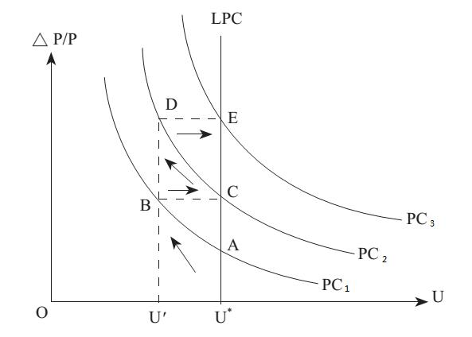

# Section 5: Natural Rate of Unemployment

As mentioned in Lecture 19, even Friedman, the head of the monetary school, advocates a moderate inflation is the lubricant of the economy. In fact, there is no function of lubricant of the economy for inflation in essence, but why do western governments generally like to have a moderate inflation? If there is minimum wage law, trade unions, social welfare and other factors that cause wage rigidity, a moderate inflation can help to secretly reduce the real wages without adjusting the nominal wages, thus effectively reducing unemployment and stimulating the economy.

The price in the theory of supply and demand is real price (relative price), but what can be observed in reality is monetary price (nominal price), so the equilibrium wage refers to the equilibrium of real wage instead of nominal wage. The real wage is the nominal wage divided by the price level ($w = \frac{W}{P}$). If the nominal wage (W) cannot be cut under the constraint such as minimum wage law, the real wage (w) can be cut to be closer to the equilibrium by increasing the price level (P), thus reducing the unemployment rate.

Obviously, the government makes use of the money illusion. However, illusion does not last long. Sooner or later, labor will find that there is inflation, and they will require the nominal wages to be raised based on the inflation rate. As a result, the decrease in unemployment caused by the drop in the real wages closer to the equilibrium will rebound again. Although the effect does not last long, the western governments are never bored with playing this trick, because the political system of democratic election encourages short-term behaviors. As long as the economy improves during the election and helps the politicians to be elected, it does not matter that the economy will return to the original state a little while later. With CPI, a vague and time-lagged measurement of inflation, it is easier for government to cause money illusion for a while even though many western workers have become smart and required in their wage contracts that the nominal wages must be adjusted based on the inflation rate.

In macroeconomics of MSE, there is a “Phillips Curve” that is used to show the substitution relationship between the unemployment rate and the inflation rate (the unemployment rate will be lower when inflation rate is higher, and vice versa). With the horizontal axis representing the unemployment rate and the vertical axis representing the inflation rate, the Phillips curve is sloping downwards as shown in Fig.20-4. It was originally only an empirical curve, proposed by Phillips, the economist in New Zealand, in 1958 in his article “The Relationship between the Unemployment and the Rate of Change in Monetary Wages in Britain from 1861 to 1957”, based on the relevant statistical data. Later, Paul Samuelson (1915-2009) and Solow (R. M. Solow, 1924-) replaced the rate of change in monetary wages in the original Phillips curve with the growth rate of price. In macroeconomics, this curve is used to illustrate that inflation is driven by the rise in the cost of wage, which is totally nonsense! According to the monetary theory, there can be no inflation if money is not overprinted, so the cause of inflation cannot be the increase in wages. Without increasing money supply, even if the evil policies such as minimum wage law lead to a rise in wages, firms will only choose to lay off the employees to save cost instead of raising the price to cover the cost. The correct explanation for Phillips curve is the above analysis: when there is inflation, the real wage will fall to be closer to equilibrium wage, thus decreasing unemployment.

  

 Figure 20-4

Later, Friedman put forward the “Expectations-augmented Phillips Curve” where the labor will know there is inflation in long run and requires adjusting the nominal wages based on the inflation rate. Once the nominal wage is adjusted based on the inflation rate, the real wage will return to the same as that before inflation, so does the unemployment rate, which has been shown in Fig.20-4 (from A to B then to C). Thus, the unemployment rate does not fall, but the inflation rate has risen. Therefore, the long-term Phillips curve (LPC) is a vertical line, different from the short-term curve sloping downwards, which means there is no substitution relationship between inflation and unemployment.

The intersection of the long-term Phillips curve and the horizontal axis is named by Friedman as the “natural rate of unemployment” (U* in Fig.20-4). The definition of natural rate of unemployment in MSE is the equilibrium unemployment rate without the influence of monetary factors on supply and demand in the labor market and the product market. In other words, it is the unemployment rate under the condition of full employment, and it is the sum of frictional and structural unemployment rates”. However, this definition is also totally nonsense. If the labor market and the product market can be free from interference, how can be there unemployment? If it refers to the sum of frictional and structural unemployment rates, how can it be reduced by a moderate inflation? How can more money supply make the unemployed without IT skills find jobs in the IT industry?

The correct definition of the rate of natural unemployment should be the unemployment rate that cannot be eliminated fundamentally by inflation. The causes of it cannot be frictional or structural, but the institutional factors that prevent the market mechanism working and lead to wage rigidity, such as minimum wage law, trade unions and social welfare. Although the information cost will also cause unemployment, without the government interference, it will gradually drop over time, and the unemployment rate will also drop. Only the institutional factors can cause long-term unemployment.

According to the monetary theory, the monetary policy cannot adjust the economy but cause economic fluctuation or business cycle. Nor can it eliminate unemployment but cheat the labor for a short time with the money illusion. However, the labor is not foolish, so the final result is just inflation.

The unemployment caused by the institutional rigidity stemmed from evil policies can only be eliminated by institutional reform. For example, before the reform and opening up policy began in 1978, there were a large number of “unemployed youth” and also even more hidden unemployed in the state-owned enterprises because they actually did not need so many employees. There was such a joke: three workers were needed to fill a hole on the wall, one was carrying a bucket of cement paste, one was carrying a tool for filling the hole, and another was pointing at the hole with his finger! China transformed from the planned economy to the market economy, breaking the iron bowls of employees in state-owned enterprises. Although the employees in state-owned enterprises had experienced the pains of layoff, the rapid economic growth created a large number of jobs for them, which quickly eliminated the unemployment and did not have the adverse consequence of inflation.

As for the unemployment caused by information cost, because the information cost will gradually decrease over time, and there will also be information experts in the market to help to reduce it in order to earn the rent of information. If government wants to help, it should try to effectively reduce the information cost. However, in reality it is much more usual that what government does is to increase the information cost.

