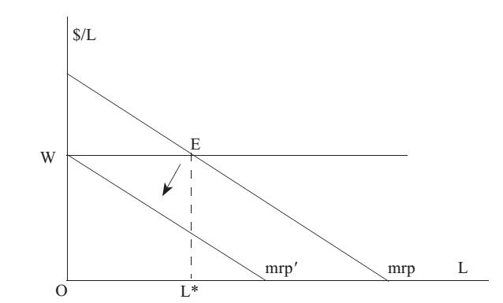

# Section 1: The Concept of Rent Dissipation

The example of Pigou’s highways mentioned in the previous lecture can be analyzed from the perspective of rent dissipation. If the “Short Way” is delineated as PPRs, the owner can obtain income (rent) through market transactions, but in Pigou’s example it is public, so the competition of drivers leads to congestion, increasing the driving time and causing the rent of it to fall to zero. In other words, the MC of driving time is equal to the tolls if there is an owner, but the rent only dissipates when the “Short Way” is public. The costs of drivers are actually the same, just when is an owner, they pay the costs in the form of tolls that become the income (rental) of the owner, while when there is no owner, the costs of driving time increase to offset the rent that does not become anyone’s income but dissipates.
Later, an economist named H. S. Gordon extended the example of highways to that of high seas, and put forward “the Tragedy of the Commons”. The rent of common goods that are not delineated as PPRs will drop to zero due to too many competitors and overuses. The term “rent dissipation” was first put forward by him, but there are mistakes in his analysis. Steven N. S. Cheung has given the correct analysis with an example of a lake in his “Economic Explanation”.

The analysis can be presented by the Fig.20-2, but the general production factor specifically refers to the labor input of fishermen, so the horizontal axis of Fig.25-1 is L, and the vertical axis is the price of labor (W) that is the highest wage the fishermen have given up in other industries.

If there is an owner of the lake, he will restrict the total fishing time (the number of fishermen multiplied by the fishing time per capita) to L\* where the equilibrium condition of mrp＝W is satisfied, and the total fishing income is WEL\*O, while the rent of the great lakes is the triangle above WE.

If the lake is ownerless or a common good, without the restriction of the owner, people will flock to fish, and one more fisherman join in will cause the others’ mrp to move a little toward the lower-left because he will occupy the others’ fishing spaces and opportunities. Thus, the equilibrium point (E) of mrp＝W will move along the horizontal line of WE to the left, which means L\* is decreasing or the others are reducing a little fishing time[^1] . As a result, the triangle area above WE is constantly decreasing, which means the rent of the lake is constantly decreasing. More and more people join in fishing, and everyone’s curve of mrp is moving towards the lower-left until the equilibrium point (E) approaches the point W infinitely (or the curve of mrp moves to mrp’) where everyone’s fishing time approaches 0 infinitely and the triangle area above WE drops to nearly 0, which implies all the rent of the lake dissipates.

  

 Figure 25-1

In reality, it has never been seen that countless people compete for the use of common goods, neither their participating time close to 0, because different people have different costs of time, skills and information costs that lead to different mrp and W. When some’s curves of mrp have moved to mrp’, another’s are still at the upper-right, so the latter’s participation time will not be as low as 0, but the triangle above the WE for them does not represent the rent of the common good (such as the lake), but the rent obtained by them due to their lower costs of time, or better skills, or the better information. On the other hand, in reality, government often restricts competition by limiting the number of participants (such as by license), so that the rent of common goods will not dissipate to 0.

Thus, the concept of rent dissipation can be deduced based on the above analysis. When the rights of an asset are not lineated as private, people will compete to use it with non-price criteria, resulting in a decline in the income (rent) of it.

Attention: although the rent dissipation of highways or high seas (the lake) is caused by too many users in the Pigou’s, the Gordon’s and the Cheung’s examples, in reality, there are other cases of rent dissipation that the assets are used to produce lower rent, which also leads to the decline in rent. For example, there is a pasture in Africa, where the climate and soil are suitable for planting almond trees with high value. However, because it is a common good, no one will plant almond trees there, but use it for grazing cattle and sheep. Cattle and sheep are private property, and can be driven home at night, while almond trees cannot be prevented from cutting off and stealing away.

- - - -

[^1]: The number of fishermen cannot be reduced because there is no owner to restrict