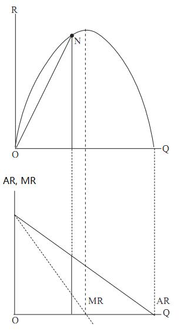
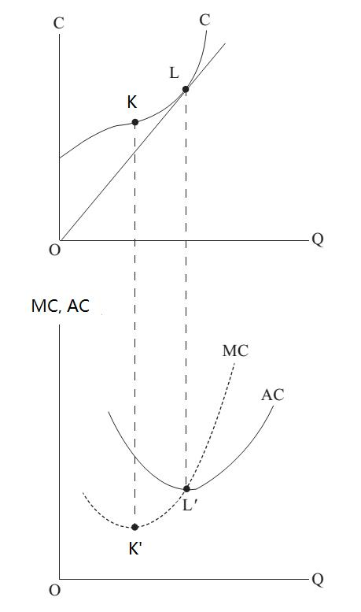

# Section 2: The Concept of Margin

What will be introduced next is the analysis tool for finding an optimum which is the essential analysis tool in economics: marginal analysis.

In Lecture 3, the postulate of self-interest has been explained in detail, which refers to that human will try to achieve the best result with the least cost. It is the same meaning of optimum.

As mentioned in Lecture 6 about the history of economic thinking, an essential development in the process from classical economics to neoclassical economics is the introduction of mathematics as a deductive tool. Then how to interpret the postulate of self-interest in terms of mathematics?  The answer is the method of finding extrema: the least cost is finding minimum value, while the best result is finding maximum value. Furthermore, how to find extrema in mathematics? In geometry, it is to find where the slope of a curve is zero, or the tangent of a curve at that point is horizontal. While in algebra, it is to find when the derivative is zero.
A new and important concept of margin is born by the introduction of this mathematical thought (not only the calculation) into economics. From the 1870s to the beginning of the 20th century, the British economist William Stanley Jevons, the French economist Léon Walras of Lausanne School and Carl Menger of the Austrian School independently put forward “margin”, which is called "marginal revolution" in the history of economic thinking. From then on, there is marginal analysis everywhere in economics.

What is “margin”? Since this concept initially came from mathematics, the following expounding will start from the perspective of mathematics, and then extend to the economic implication which is not entirely the same as mathematics.
Readers should be very familiar with two kinds of magnitudes: total magnitude and average magnitude. For example, the total weight of all people in a room is a total magnitude, while the average weight or the weight per capita is calculated by dividing the total weight by the number of people. However, the most crucial magnitude in economics is not total and average magnitudes but marginal magnitude. If someone walks in, which increases the number of people, the total weight will rise. The weight of that person is a marginal magnitude. Moreover, if someone walks out, which decrease the number of people, the total weight will fall. The weight of that person is again a marginal magnitude. 

Let us take an economic example. The two geometric diagrams in Fig.7-1 respectively show the relationship between total revenue (R), average revenue (AR) and marginal revenue (MR). The upper diagram pictures the R function, and the lower diagram the associated AR and MR function. Warning: A total magnitude (such as R in the upper panel) should never be plotted on the same diagram as average and marginal magnitudes (such as AR and MR in the lower panel) because the units of measurement are not the same. The vertical axis of the upper diagram of Fig.7-1 is scaled in dollars, whereas the lower diagram is scaled in dollars per unit quantity.

Figure 7.1

In algebra, the average magnitude is derived from total magnitude such as $AR = \frac{R}{Q}$, while the corresponding marginal magnitude is $\frac{ΔR}{ΔQ}$. According to calculus, if the units of R are continuous, and the change of Q (ΔQ) is infinitely small, it can be rewritten as $\frac{dR}{dQ}$which is a derivative.
In geometry, the average curve is also derived from the total curve. The magnitude of any point on an average curve is the slope of a ray from the origin to the corresponding point on the total curve. Take point N in Fig7-1 as an example. The slope of ON is the ratio of the opposite side to the adjacent side, which is dividing Y-coordinate of point N by X-coordinate of it. Y-coordinate represents total revenue (R), while X-coordinate represents quantity (Q). So the diagram implies the same as $AR = \frac{R}{Q}$ in algebra. How about marginal magnitude? According to calculus, the derivative is the same as the slope of a curve in geometry. Therefore, the magnitude of any point on the marginal curve is the slope of the total curve.
After the introduction about the derivation of average and marginal magnitudes from total magnitudes in terms of algebra and geometry, let us turn to the relations among these three magnitudes. There are a series of propositions.

Let us continue to take the previous example of people’s weight in a room. When a person walks in, his weight as a marginal magnitude is positive, and the total weight of the people in the room will rise. So the first proposition about the relationship between total magnitude and marginal magnitude is: When a total magnitude is rising, the corresponding marginal magnitude is positive. On the contrary, if a person walks out, his weight as a marginal magnitude is negative, and the total weight of the people in the room will fall. So the second proposition about the relationship between total magnitude and marginal magnitude is: When a total magnitude is falling, the corresponding marginal magnitude is negative.

Then look at the upper diagram Fig7-1, where is the maximum value of the total revenue (curve R)? It is on the “top of the mountain”. What is the slope there? The answer is zero. That is why in the lower diagram in Fig7-1, the corresponding point in the MR curve is on the X-axis, which means the X-coordinate is zero there. This total curve is a parabola going downwards, but if it is a parabola going upwards, the minimum value of it is at the “bottom of the valley”, where the slope is also zero. So extreme value, no matter it is a maximum or a minimum, appears where the slope is zero on the total curve. In other words, when a total magnitude reaches a maximum or a minimum, the corresponding marginal magnitude is zero, which is the third proposition.

The previous three propositions are all about the relations between total and marginal magnitudes, and how about average and marginal magnitudes? Suppose a person walks in, but he now needs to be classified as “fat” or “thin”. If he is heavier than the average weight of the people in the room before he walks in, he is fat. On the contrary, if he is lighter than the average weight, he is thin. It is very reasonable. If a “fat” walks in (geometrically the marginal curve lies above the average curve), the average weight will rise. If a “thin” walks in (geometrically the marginal curve lies below the average curve), the average weight will fall. If a person who is neither fat nor thin (i.e. he is as heavy as the average weight) walks in, the average weight will not change.

To sum up, when the average magnitude is falling, the marginal magnitude must lie below it, which is the fourth proposition. On the contrary, when the average magnitude is rising, the marginal magnitude must lie above it, which is the fifth proposition. Finally, when an average magnitude is neither rising nor falling (at a minimum or maximum), the marginal magnitude equals the average magnitude, which is the sixth proposition.

Geometrically, the marginal curve passes through the highest or lowest point of the average curve. Fig.7-2 shows the relations among these three magnitudes taking total cost, average cost and marginal cost as the example. Let us focus on the lower diagram of average and marginal cost curves which are both parabolas going upwards. To the left of point *L*, the MC (marginal cost) curve lies below the AC (average cost) curve, which means MC＜AC, so AC is pulled down by MC. To the right of point *L*, the MC curve lies above the AC curve, which means MC＞AC, so AC is pulled upward by MC. The AC curve is falling to the left of *L* and rising to the right of *L*, so *L* is a turning point where is the “bottom” or the lowest point of the AC curve, and through which the MC curve passes.

Figure 7.2

Readers can deduce by themselves the reverse case where both the average and marginal curves are parabolas going downwards. In the beginning, the marginal curve lies above the average curve, pulling it upward. Later, the marginal curve lies below the average curve, pulling it downward. The turning point, where the average curve changes from rising to falling, is the “top” or the highest point of the average curve, and through which the marginal curve passes.

