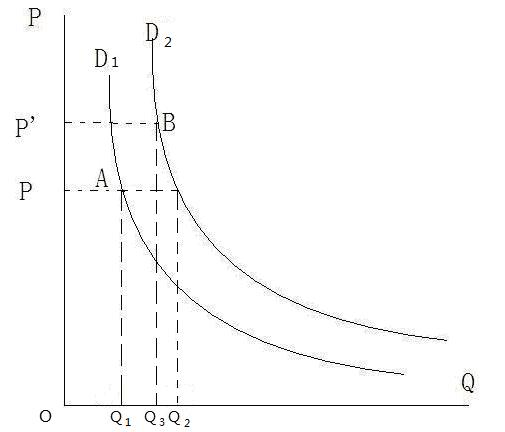

# Section 2: Ceteris Paribus

There is “ceteris paribus” at the very beginning of the law of demand. Why? Because there are in fact many factors that affect quantity demanded, not just price. For example, preference and income are also factors that can affect quantity demanded. If one prefers to apple, he will tend to buy apples even at higher price. Or even if the price of apples remains unchanged, with higher income, one will usually tend to buy more apples. However, the law of demand focuses on the relationship between price and quantity demanded, so it is necessary to assume that other factors other than price, which may also cause changes in quantity demanded, remain unchanged, in order to separate the influence of price on quantity demanded. In some economic literatures, the variables studied by the theory or model are called endogenous variables, while the other factors that are not studied but also affect the dependent variables are called exogenous variables.

 “Ceteris paribus” is very important, so it needs to be discussed in detail. Firstly, the law of demand assumes “Ceteris paribus”, which is not like the postulate of selfish-interest which does not need to be proved, not allowed to be questioned, and will never change. Assumption is different from postulate, and is a prerequisite of the application of a theory. If the prerequisite of a theory has not been satisfied, even the prediction of the theory is inconsistent with the fact, it is wrong to claim that the theory is refuted by the fact. It is not the fault of the theory, but of those who wrongly apply the theory.

For example, suppose there is a vendor sitting by the street and selling umbrellas for 10 RMB. One day it suddenly rained, and he raised the price to 20 RMB. However, more umbrellas were sold out on that day. Does it refute the law of demand? Of course not, it is the weather as other factor that has changed. There is a series of specific other factors, including the sunny day, behind the demand curve corresponding to the price of 10 RMB. If it is rainy day, this other factor has changed, and the original demand curve of sunny day will no longer apply. Another new demand curve should take the place.

Suppose that D1 in Fig. 8-2 is the demand curve of umbrella in sunny days and D2 in rainy days. Behind D2 there is a series of specific other factors which are the same as the initial D1 except the “weather” changing from sunny days to rainy days. This new demand curve is obtained by moving the initial one parallel to the right, because at each price level, the quantity demanded corresponding to the D2 is higher than that corresponding to the D1. For example, when the price is P, the quantity demanded corresponding to the D1 is Q1 and that corresponding to the D2 is Q2, which shows that at every price level, due to the influence of rain, the quantity demanded for umbrellas is higher than in sunny days.

  

Figure 8-2

Those who neglect the prerequisite of the law of demand are wrong in directly connecting the point A and point B as a demand curve which slopes upwards. There must be prerequisites for any theory, which is also a part of the theory itself. Take an example in mathematics: when we say 1+1=2, there is an implicit prerequisite of decimal system, but if binary system is actually applied, such as for computers, this calculation is wrong.

Therefore, the difference between “quantity demanded” and “demand” should be paid attention to. Geometrically, quantity demanded refers to the point on a specific demand curve, so the change in it means the point moving along the same demand curve. And demand refers to the whole demand curve, so the change in demand means the whole curve moving or the point jumping from one demand curve to another.

Many may think: hey, isn't it obvious? How can anyone make such a stupid mistake? Is it necessary to expound in such detail? However in reality, there are so many economists who make such mistakes, because the changes in other factors are sometimes not so easy as that of changing from sunny days to rainy days in previous example of umbrellas.

There was a big debate in economics of China about whether the demand curve could slope upwards which was dubbed as “the demand curve getting its tail up”. Those who advocated that the demand curve could slope upwards are not only ignorant to economics but also to the methodology of science. The law of demand is the axiom of economics, which is the same as the postulate in that it does not need to be proved and must be accepted. If one does not accept the axiom, please get out and establish a new “economics with demand curve sloping upwards”. What’s more, it is not allowed to advocate that the demand curve sometimes slopes downwards and sometimes upwards, because it will make the law of demand become irrefutable tautology which seems to be able to explain everything but in fact explain nothing at all. When the fact is in favor of supporting the demand sloping downwards, it is convenient to say that now the demand curve sloping downwards apply, and vice versa. As a result, it is always true and impossible to be refuted by facts, but just becomes unscientific.

However, those who advocated that the demand curve could slope upwards argued that they had observed phenomena refuting the law of demand law or the demand curve sloping upwards. Really? Let's take three typical examples given by them, and judge by the law of demand.

The first example came from a post on an economics forum of a famous university when the debate was hot. The poster said that he saw with his own eyes a clothing store where a skirt was priced 20 RMB but could not be sold out, while later, when the price was increased to 200RMB, it was quickly sold out. Did it refute the law of demand? Of course not. But why? Because some other factors had changed. But what were they? It may not be so obvious in reality.

The answer is that other factors here are information costs. The buyer of the skirt certainly did not know that it had been priced 20RMB. If he knew and did not buy when it was priced 20RMB but chose to buy when it was priced 200RMB, his behaviors really refuted the law of demand, which exactly implies that the law of demand is refutable and scientific theory instead of tautology, because it can present the refutable condition. The poster must know that the same skirt had been priced 20RMB before, which meant his information cost was lower, so he would not buy it. He wrongly regarded the buyer’s information cost the same as his, or wrongly regarded the buyer’s demand curve the same as his, so was wrong in directly connecting the point on his demand curve and that on the buyer’s demand curve to form a so-called demand curve sloping upwards.

This example needs to be further explained. With information costs which is one kind of transaction costs, consumers are generally not so good at judging the quality of goods in the market as producers, so they adopt the strategy of “judging quality by price” to reduce the relevant information costs. Generally the better the quality is, the higher the price is, which means quality is also a kind of other factors, there are different demand curves for better-quality goods and poorer-quality ones. Thus consumers tend to think that higher-priced goods are of better-quality. However, some sellers will make use of this strategy of “judging quality by price” of consumers to deceive them by deliberately setting a higher price for poor-quality goods. Of course, in the long run, market competition will eliminate this deception, because the information about the good will gradually spread which means the information cost will fall over time. It takes time for consumers to know the truth, which implies there are information costs. For a while, due to the constraint of information cost, some consumers were deceived into thinking that the skirt priced 200RMB was of better-quality than those priced 20RMB.

There are two reasons for the demand of the skirt increased after the rise in price. Firstly, the buyer did not know the skirt had been priced 20RMB before, and misjudged the quality of it by the price of 200RMB. Secondly, the demand curve for the skirts of better-quality priced 200RMB is located to the right of that for the skirts of poorer-quality priced 20RMB. In other words, the demand, instead of quantity demanded, for the skirts of better-quality priced 200RMB is greater than that for the skirts of poorer-quality priced 20RMB. As long as one of the above two conditions is not satisfied, the phenomenon seen by the poster will not occur. Take the poster himself for example: he knew the skirt had been priced 20RMB, so he would never misjudge the quality of it. Or if the skirt was priced 20,000RMB, consumers would doubt if a skirt of such top quality would be sold in a small store, so would not be so easily deceived. Even if some consumers were deceived to buy, the demand for the skirts of such “top-quality” would generally be lower than that of the skirts of poorer-quality priced 20RMB.

Next is the second example which came from an economist: the tuition of MBA (Master of Business Administration) was increasing year by year, but more and more applied for it. Did it refute the law of demand? Again of course not, and again because some other factors had changed which caused the demand curve of MBA to move to the right. It is logically similar to the above example of umbrellas, so Fig. 8-2 can be directly used to explain it.

What other factors had changed in this example? It is not so simple as the example of skirts just now. Only when you have a deeper understanding of the reality can you find out the key. Firstly, MBA was new to many at the very beginning, and few knew it well and did not know whether it was worth its tuition much higher than that of ordinary master degrees in business, so most would just wait and see, and few would try to apply. It is also due to the constraint information costs.  However, people gradually got to know MBA over time, thus increased the demand for it, which meant the fall in information costs had moved the demand curve for MBA to right. Secondly, the network of interpersonal connections is very important in doing business. Relatives, friends, fellows from the same town or province, classmates ... all can shorten the distance between people and are helpful for business. The majority of MBA students are businessmen, so it is certainly a good opportunity for them to form a network of classmates. In other words, MBA is to some extent similar to golfing. The value of education (or sports) in fact is not the most important, while it is much more important that it is a social platform for specific circle of people to form a network. With more and more students applying MBA, the value or the quality of MBA as a social platform was increasing, so its demand curve had moved to right.
To sum up, economics is usually not very difficult, but the application is rather difficult because we must have an in-depth and detailed understanding of the reality. Otherwise, only the prerequisite of “ceteris paribus” is enough to confuse many economic students and even economists. That’s because they do not have a good grasp of the law of demand, but also because they do not have enough knowledge of the reality.
