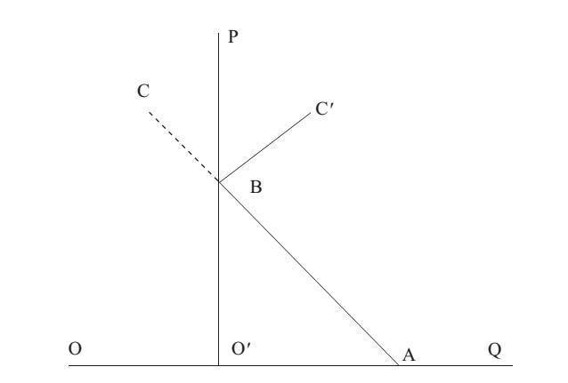

# Section 1: The Supply Curve

The last lecture is about the law of demand, while this lecture turns to the supply curve.

Supply curve and demand curve are actually the same curve. Since the theory of producers has not been introduced, let’s temporarily assume a world without production. In the absence of production, why are supply curve and demand curve the same curve? Suppose ABC in Fig. 9-1 is a demand curve for an individual. The point B means that when the price is O’B, the quantity of the good he holds is OO’ (caution: O is the original point where the quantity demanded is zero).  If the price drops from point B, according to the law of demand, he will increase the quantity demanded for the good, which means he moves along BA. On the contrary, if the price rises from point B, he will reduce the quantity demanded. But how? The answer is: sell the good he holds.  That is supply! Using O’B as a mirror, the inverted line of BC can be drawn as BC’ which is exactly a supply curve sloping upwards. So it is clear that supply curve is actually the inverted image of demand curve.

  

  Figure 9-1

The economic implication of Fig. 9.1 is whether a person is a buyer or a seller, a consumer or a supplier depends on the price. If the price is low enough, people will choose to be buyers, and the lower the price is, the more they will buy. On the contrary, if the price is high enough, people will choose to be sellers, and the higher the price is, the more they will sell. Supply and demand can transfer from one to the other, depending on the price.

Since supply curve and demand curve are actually the same curve, the characteristics of supply curve are the same as those of demand curve, such as (1) quantity supplied is an intention, while the quantity of sale is a fact; (2) quantity supplied is different from supply, and the change of the former refers to the movement of a point on the same supply curve, while the change of latter refers to the movement of the whole supply curve. Readers should be able to analogize all of them from demand curve.
