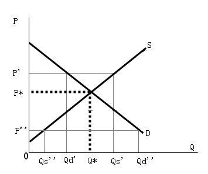

# Section 2: The Theory of Supply and Demand

Combine the demand curve and supply curve, the theory of supply and demand is deduced. As shown in fig. 9-2 where the demand curve and supply curve of different people for a good are drawn in the same graph, the intersection point is P\*, the equilibrium price which determines Q\*, the equilibrium quantity. Caution: it is the price that determines the quantity, not the reverse, because the price is an independent variable and quantity is a dependent variable. Of course, it has stressed in Lecture 7 that there is problem for the concept of “equilibrium”. Specifically, quantity demanded and supplied are both intentions. Are they equal to each other? God knows. My opinion is: it is always in equilibrium, so quantity demanded is always equal to quantity supplied.

  

  Figure 9-2

There is no such thing as disequilibrium, but in order to understand why P\* is the equilibrium price, just imagine the so-called disequilibrium when the price is not P\*.
There are two possibilities of disequilibrium, one is the case when the price is higher than P\*, the other is the case when the price is lower than P\*.

When the price, such as P’, is higher than P\*, the sellers are so willing to sell more of the goods that the quantity supplied is Qs’, while the buyers are so reluctant to buy that the quantity demanded is Qd’. There is oversupply in the market, and only the quantity of Qd’ can be sold out, while the quantity of Qd’ Qs’ cannot. The diagram only tells us that the quantity that can be sold out at the price of P’ is Qd’, but it does not tell whose goods are the “lucky ones” that are those sold out. In other words, the sellers must compete to become the lucky ones. Suppose the qualities of the goods are the same, the sellers can only compete with price by cutting prices to attract buyers, so the price of P’ cannot be stabilized and fall. As the price falls, the sellers’ desire to supply is hit, and some reduce supply, and some even leave the market completely, so the quantity supplied decrease. On the other hand, the buyers’ desire to buy is stimulated, and some has bought increase demand, and some has not bought become to want to buy, so the quantity demanded increase. Thus, the oversupply in the market decreases. However, as long as there is still oversupply, there will be some goods that cannot be sold out, and the competition among the sellers will push them to continue to reduce the price. The price cannot be stabilized until it decreases to P\*. Until then the quantity demanded and supplied are both Q\*, and all goods can be sold out, so the sellers do not need to reduce the price any more.

On the contrary, when the price, such as P’’, is lower than P\*, what will happen? Logically similar to the above analysis, it can be deduced that there is over-demand in the market, and only the need within the quantity of Qs’’ can be met. Now it is the buyers who have to compete to become the “lucky ones” by increasing the price. As the price rises, the buyers’ desire to buy is hit, while the sellers’ desire to supply is stimulated, so the over-demand in the market decreases. However, as long as there is still over-demand, there will be some buyers’ needs that have not been met, and the competition among the buyers will push them to continue to increase the price. The price cannot be stabilized until it increases to P\*.

The above process from disequilibrium to equilibrium is just imagined for logical reasoning. In reality, it is always in equilibrium. If it seems to be in disequilibrium, it must be due to the neglect of transaction costs for both the buyer and seller in adjusting their behaviors, including changing the price or quantity. If there were no transaction costs, all adjustments would be completed in an instant. Precisely because there are transaction costs, it is in equilibrium in every instant.

When other factors have changed, the whole demand curve or supply curve will move, causing the equilibrium to change. In the previous lecture, a large number of such examples have been explained, so it will not be discussed here anymore.
