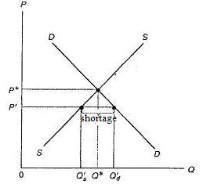

# Section 3: The Traditional Analysis of Price Control and Its Problem

There are two kinds of government intervention in price: price ceiling and price floor.

“Price ceiling” refers to the government’s policy or law to repress the price to be lower than the equilibrium price. The price ceiling must be lower than the equilibrium price, otherwise it is meaningless. Price ceiling is also called “price control”.

In contrast, “price floor” refers to the government’s policy or law to inflate the price to be higher than the equilibrium price. Price floor must be higher than the equilibrium price, otherwise it is meaningless. Price floor is also called “minimum price” or “price support”.

Both price ceiling and price floor are government interventions in price, which are essentially infringements of PPRs. As mentioned briefly before, there are three rights in PPRs: the use right, the right to income and the right to transfer. Among them, the use right and the right to transfer are actually needed to establish the right to income, because only when people can freely use and transfer the goods they hold, can they fully obtain the income from the goods. It is the right to income that is directly infringed by government intervention in price. This good belongs to me. I want to trade it at this price. On what legal basis can the government forbid me? Isn’t it an infringement of my right to income?

Price control infringes the seller’s right to income, while price floor attempts to infringe the buyer’s right to income. To say “attempt” means it is actually not successful. Before the transaction, the PPRs of the goods were in the hands of the seller instead of the buyer. The buyer foresaw that his right to income would be infringed after the transaction, and he simply chose not to buy to avoid infringement. Therefore, price floor actually infringes the seller’s PPRs, just not on the right to income right, but on the right to transfer because the seller cannot exercise his right to transfer at such a high price. Of course, when the right to transfer cannot be exercised, the right to income will be inevitably affected, because unless it is in an autarky world where there is no trade, the income from goods is mostly realized by transfer (sale).

Let’s analyze price control firstly.

Fig.9-3 is the geometric analysis of the consequences of price control in MSE. The equilibrium price is P*, but the government imposes price control to repress it to P’. At such a low price, sellers are reluctant to supply, so the quantity supplied is only Qs’. However, buyers are very willing to buy, so the quantity demanded is as high as Qd’. There is over-demanded in the market, which is called “shortage”. As a result, only the need of Qs’ can be met. In other words, the consequence of price control is that fewer buyers’ needs are met, while sellers’ incomes drop, which can be described as loss at both sides.

  

  Figure 9-3

However, this analysis of MSE is wrong. Because quantity demanded and supplied are both intention, only God knows whether they are equal to each other, and there is no way to test which is more or less than the other. In other words, the so-called “shortage” is not a fact. Attention: the concept of “scarcity” mentioned in Lecture 4 is a fact, because the scarce goods have prices, and the scarcer a good is, the higher its price is, which are all observable facts. But what about “shortage”? There are no observable facts about it. What can be observed in reality is the quantity of purchase and sale, not the quantity demanded and supplied. However, the quantity of purchase is always equal to that of sale, no matter there is price control or not, because they are actually the quantity of transaction: from the buyer’s point of view it is the quantity of purchase, while from the seller’s point of view it is the quantity of sale. Therefore, the analysis on price control of MSE is logically wrong.

Next, the conclusion of analysis of MSE will be tested by facts. The conclusion is that price control will lead to a decrease price and in quantity demanded which should be referred to quantity of transaction. But really?

Suppose a landlord rents out a house, and receives RMB1000 a month. Now all of a sudden, the government imposes a rent control of RMB800 a month which is said to help the poor afford to rent a house. What will the landlord do? The economic implication of the analysis of MSE is that he will submit to the price control, but only rent out 80% of the house, which is obviously refuted by facts. In reality, the landlord will try to go round the price control, and get the original price back. There are many ways to achieve it, and the simplest way (with the least transaction cost) is: the landlord rents the house by RMB800 a month in name only, but charges RMB2400 of “contract fee” before signing a one-year lease contract with the tenant. Who refuses to the contract fee, the landlord will not rent the house to him, so he actually collects the same rent of RMB12, 000 a year as before. The problem is if the tenant will accept the extra contract fee. If he accepted the rent of RMB1000 a month before, he would certainly accept the extra contract fee, because the contract fee shared over the 12 months of a year is RMB200, the sum of which and the nominal rent of RMB800 is no different from the original RMB1000. Moreover, what is more important is that in fact there cannot be houses worth RMB1000 in the market that are currently rented in RMB800 without any contract fee. As long as a landlord think of the idea of contract fee to go around the price control and get the rent back, others will get to know, so all landlords will do so, the tenant can only accept the extra contract fee, just as he accepts the equilibrium rent in the market before the imposition of price control.

In reality, there is really contract fee. There is rent control in New York. As a result, a tenant has to pay a sum of money called “key money” to buy the key to the house when he moved in, in addition to the namely low rent. How can a tenant enter the house without the key? Therefore, the “key money” is essentially the contract fee mentioned above. There had also been a case in New York that a tenant was required to buy a broken chair at a ridiculously high price which was actually the contract fee again. The Landlords would use various names for contract fee by which took back the rent infringed by government control.

Similar phenomena occurred in Hong Kong when rent control was imposed. The landlords in Hong Kong were so imaginative that they invented “shoe money”. It meant that the landlords had been walking around to find the suitable tenants and worn out their shoes, so the tenants should pay them to buy new shoes. Of course, the price was entirely not determined by the actual costs of the shoes themselves, but by the rent infringed by government control.

Let’s look at another example in reality. There had been oil shocks in the 1970s, and the US government had imposed price control on petroleum for four times in an attempt to curb inflation by suppressing the rise in petroleum price. However, this was actually a drug rather than an antidote, because once the price control had been abolished, the petroleum price would rebound sharply, causing the consumer price index (CPI) to rise again. During the period of price control on petroleum, it was common for cars to line up to wait for refueling. And the petrol stations had also come up with a new trick: cars that refuel and lubricating can have priority to refueling.  Only petrol was subject to price control, while lubricant was not, so the petrol station increased the price of lubricant so that the regulated part of the price of petroleum was transferred to lubricant. It is a kind of tie sale of a good with price control and another good without price control to transfer the regulated part of the price of the former to the latter.

Some may suggest government should also impose price control on lubricant. It can be expected that the petrol station will change tie sale of petroleum and car washing. What if government also imposes price control on car washing? Again, the petrol station will change to tie sale petroleum and the shopping in the store of the station. Unless the petrol station is nationalize to a state-owned enterprise, it can always “invent” some kinds of tie sale to get back the regulated part of price of petroleum.
It should be always remembered that human is self-interested and there is scarcity everywhere, which cannot be changed by price control, so neither can it be changed that there must be competition criterion to deicide winners or losers. Without price control, price criterion is used to determine who can get those scarce goods in competition. With price control, part of the price criterion has been abolished, but the question of who can get the scarce goods by competition is still there. Under different constraints, people will use different ways to solve this question, sometimes going around price control and back to price criterion (such as contract fee or tie sale), sometimes using other non-price criteria (such as queuing) instead. There are numerous ways, which will lead to the “unconstrained” problem mentioned in the introduction of methodology of science in Lecture 2. Therefore, the key of economic analysis on price control is not shortage the MSE is concerned with, but the law that determine what ways people will use to take place of price criterion abolished by price control.

Under price control, part of the sellers’ rights to income are infringed by government, but government just forbid them from collecting that part of the price (income) in the former way, and does not clearly stipulate who owns that part of income, so self-interested people (mostly the sellers, but sometimes the buyers) will try their best to grab it (the seller would think that he only took back the income he deserved). In fact, self-interested people are not competing for the scarce goods, but this part of income, because who is the owner of it becomes unclear due to price control. Of course, it must cost much to grab the income, which implies that there is transaction cost. It is also determined by the postulate of self-interest that the way that could grab the most income with the least transaction cost will be used. This is precisely the law that the theory of price control should seek to explain people’s choice under price control.

In conclusion, price control is a very complicated issue, involving the ownerless income due to the partial infringement of PPRs, so self-interested people compete for grabbing it which leads to rent dissipation (a kind of transaction cost). However, self-interested people will also try to reduce the loss rent dissipation as much as possible. This issue will be explained once more in detail in the following lecture of “Rent Dissipation”.
