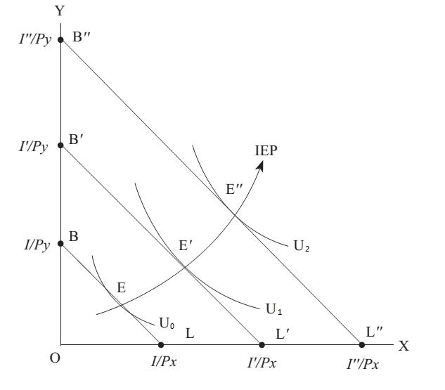

# Section 5: The Changes of the Optimum of the Consumer

In the previous section, is has been explained how to find the optimum of the consumer: based on the two axioms about preference and the concept of utility (or use value), indifference curve is derived, the contingent point of which and the budget line reflecting the two main constraints of income and price determines the optimum of the consumer or the so-called consumption equilibrium. If the constraints change, the optimum or equilibrium will change too. This will be explained in this section.

Since the budget line reflects the two main constraints of income and price, the equilibrium changes caused by the changes in income and price are discussed separately below. Let’s look at the income change first. As shown in Fig.10-8, if income rises from I to I’ while prices are held constant, the budget line shifts outwards parallel to itself, from BL to B’L’. The new optimum position is at point E’, where the budget line L’ is tangent to the higher indifference curve U1. As can be seen from Fig.10-8, points E, E’, E’’ are equilibrium points when the income is I, I’, I’’ respectively. Connecting all these equilibrium points, a curve called “Income Expansion Path (IEP)” can be drawn. Each point on this curve is an equilibrium point, only reflecting different incomes.

  

Figure 10-8

  

Figure 10-9

The shape of IEP can be that in Fig.10-8 or be that in Fig.10-9. For the IEP in Fig.10-8, when income increases, the consumption of both X and Y rises. However, for the IEP in Fig.10-9, when income increases, only the consumption of Y rises, while that of X falls. Both goods in Fig.10-8 and Y in Fig.10-9 are called superior goods, while X in Fig.10-9 is called inferior good. Caution: an inferior good is not a good of poor quality, but just refers to the good that the consumer will buy less when his income rises. For example, a bicycle may be a typical inferior good. One chooses to ride bicycle when his income is low, and change to car when his income rises, but his bicycle is not necessarily of poor quality. Now in many developed countries, when people's incomes are higher, they have become more environmentally friendly, and there is a tendency to return to bicycles. In this case, it is car that has become an inferior good!

The IEP shows how consumption baskets (combinations of goods) change as income rises or falls. The Engel Curve pictures the effect of income changes upon a single good X with the horizontal axis as income and the vertical axis as the quantity of X, such as Fig.10-10. The Engel curve is named after a German statistician Engel, because his research on the relationship between income and consumption is the most famous. Obviously, EC1 represents a superior good, while EC2 represents an inferior good.

  

Figure 10-10

Next, let’s look at the equilibrium change caused by the change in price. The slope of the budget line in Fig.10-11 represents the relative price of X and Y, so the change of it reflects the change in price, which will also cause the change of tangent point of the indifference curve. The points E, E’, E’’ in Fig.10-11 are equilibrium points with different prices. Connecting all of them, a curve called “Price Expansion Path (PEP)” can be drawn. Each point on this curve is an equilibrium point, only reflecting different (relative) prices. In Fig.10-11, only the (absolute) price of X changes, so the intersection point of the budget lines and the vertical axis has not changed, and just the intersection points of them and the horizontal axis have changed. The PEP drawn under such constraint (the absolute price of Y remains unchanged) starts from point B, and it is impossible to be higher than the vertical magnitude of point B (the horizontal dashed line in Fig.10-11). However, in reality, the (absolute) price of X and Y can both change at the same time, and then the intersections of the budget lines and the both axis will all change.

  

Figure 10-11

Draw both the IEP and PEP in a same coordinate system, and have a good understanding of this statement: every point in this coordinate plane must be on a certain IEP or PEP, which means that it is equilibrium. As a result, those who are used to thinking in mathematics (geometry) may be able to understand what is said in Lecture 7 that it is always equilibrium. If there is a case that seems to be disequilibrium, there must be some constraints that are neglected. Taking all the constraints into account, it is always equilibrium. Under different constraints, there are different equilibriums. As shown in Fig.10-8 and 10-11, point E’ is disequilibrium with respect to the budget line of BL’ (reflecting the constraint of a certain set of income and price), but it is equilibrium with respect to B’L’ in Fig.10-8 or BL’ in Fig.10-11 (reflecting the constraint of another set of income and price). If one thinks that the point E’ is disequilibrium, he only misunderstand the relevant constraint.

The PEP shows how consumption baskets (combinations of goods) change as price rises or falls. The demand curve pictures the effect of price changes upon a single good X with the horizontal axis as the quantity of X and the vertical axis as price, such as Fig.8-1 in Lecture 8. MSE comes up with such a complicated consumer theory just to deduce the law of demand law as a theorem instead of an axiom.

