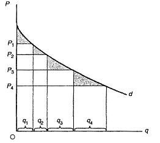

# Section 7: Turning Consumer Surplus to Producer Surplus

It seems the critique on monopoly is reasonable. However, if think more deeply, there is a great logical contradiction in the critique: how can optimum be not equilibrium? As has been explained in Lecture 7, equilibrium and optimum is actually the same, just from different perspective. If it is said that the consumer optimum and the producer optimum is not the same equilibrium, but under the same constraints, how can it happen? Different equilibriums can only be due to different constraints. Under the same constraints, both consumer and producer are in optimum, then how can the society be not in optimum?

This logic paradox implies there is serious mistake in the critique on monopoly in MSE. As has been pointed out in Lecture 7, equilibrium, as a thinking tool, can help to judge whether a certain theory or explanation is right. With the help of equilibrium or optimum, we can notice there must be mistake in the critique on monopoly in MSE, but what exactly is the mistake? The answer is: the equilibrium believed by MSE is in fact not equilibrium at all! More precisely, the situation of cost and income, supply and demand in reality is not as simple as that described in Fig.16-1.

From the perspective of consumer surplus and producer surplus, since there is benefit that no one gets (the so-called deadweight loss), why do self-interested human not try to get it back? In other words, there is deadweight loss, which implies a contradiction with the postulate of self-interest. It is logically similar to say there is a hundred-dollar bill on the ground in public, but no one tries to pick it up. Obviously, if the monopolist increases output to Qc, and decreases the price of the additional output (from Qm to Qc), so as to attract consumers to buy, the deadweight loss of FEH can be recovered (the part of FGE goes to consumers, while the part of GEH goes to the monopolist).

The mainstream economists will argue, “The monopolist will not do this, because if he increases output, the decrease in price will affect all outputs, not just the additional one. Then although he can gain more of GEH, the decrease in price will cause him suffer a loss of PmFGPc, the former is less than the latter, which is more a harm than a good to the monopolist.”

A convincing rebuttal to it is: Why must the monopolist only charge a single price for all products, rather than try to keep the same price for the original output, and only decrease the price for the additional output, so as to get the triangle of GEH back?

The mainstream economists will argue, “The monopolist will not do this, because if he increases output, the decrease in price will affect all outputs, not just the additional one. Then although he can gain more of GEH, the decrease in price will cause him suffer a loss of PmFGPc, the former is less than the latter, which is more a harm than a good to the monopolist.”

A convincing rebuttal to it is: Why must the monopolist only charge a single price for all products, rather than try to keep the same price for the original output, and only decrease the price for the additional output, so as to get the triangle of GEH back?

Anyone goes out to observe the market in reality can find that many producers will not only charge a single price for all output as MSE thinks. In other words, in reality, it is always in equilibrium or optimum, which is not what MSE criticizes.

As long as the preconceived idea that only a single price is charged for all the output is abandoned, there are actually many ways to eliminate the so-called deadweight loss of FEH, and the monopolist can even obtain more revenue than the loss of producer surplus (GEH). As a matter of fact, the monopolist is the one who will try his best to eliminate the deadweight loss, because he can make price, which means he is more convenient (with the least transaction cost) to do so than consumers.

Pricing along the demand curve

The monopolist can charge a different price for each unit of product. More precisely, he can charge the highest price that a consumer is willing to pay for that unit of product. The MR curve and the demand curve coincide completely, so in the equilibrium of MR＝MC, the optimal output is exactly the same as Qc under the market structure of price-taking. Except that all the benefits of the exchange (the area of the curved triangle of AEB in Fig.16-1) go to the monopolist, the situation is the same as the equilibrium of price-taking, so there will be no deadweight loss.

Since all the benefits of the exchange become producer surplus, and consumer surplus is zero, this kind of price arrangement can be also called “Completely Turning Consumer Surplus to Producer Surplus” (CTCS2PS). In MSE, it is mistakenly called “Perfect Price Discrimination”. The characteristic of price discrimination is to charge different price for different people, not different price for different quantity of products.

Will consumers accept this price arrangement of CTCS2PS? The answer is yes. Although the price for each unit of product is different, it is the highest price he is willing to pay, and of course he will accept, which is a tautology impossible to be wrong.

Some may think that CTCS2PS is very unfavorable for consumers because they lose all consumer surpluses, and it is unfair. As mentioned in Lecture 5, economics is not ethics and morality, so the objective and scientific judgment standard is not fairness but efficiency. If there is such a waste of deadweight loss, it is inefficient. Although CTCS2PS is a very different price arrangement from price-taking, there is no deadweight loss, which is the same efficient as price-taking. What is more, consumers are willing to accept it. The monopolist can make price, but it is consumers who have the greatest power to decide whether or not to pay the price, which determines whether producers can survive or not.

However, in reality, CTCS2PS is rarely used because it is too troublesome (with high transaction cost). Just imagine each unit of goods in a store must be auctioned one by one to determine the highest price consumers are willing to pay, how time-consuming it is!

A monopolist can get more revenue through CTCS2PS, but this price arrangement will cause an increase in transaction cost. The more completely, the higher the transaction cost is. If the use value or rent of a good is rather low, and an auction specially organized for it causes even higher transaction cost, it is obviously not worth it. That is why in reality, auction is only applicable for few goods with extremely high value, such as antiques, works of art, land, etc. It is worthy to organize an auction that costs thousands or even tens of thousands of dollars only for those goods with value of millions or even billions of dollars.

(2) Block pricing

In reality, the price arrangement of block pricing is more common, which is also called “Incomplete Turning Consumer Surplus to Producer Surplus” (ITCS2PS).[^1] In Fig.16-2, it is a case of four-part pricing. If a consumer buys a small quantity (such as q1), he has to pay a higher price (P1). When the quantity purchased is more than q1 but less than q1+q2, the price for the part of q1 is still the higher P1, while the price for the part more than q1 is the lower P2, and so on.

  

Figure 16-2

This price arrangement is actually similar to keeping the same price for the original output, and only decreasing the price for the additional output, so as to get the triangle of GEH back. As long as the output of the last part is charged the price equal to that of price-taking, there will be no deadweight loss in this block pricing, because it is only the rough version of the above pricing along the demand curve. The pricing along the demand curve is that the quantity of each part is only one unit (i.e. q1=q2=q3=…=qn=1), which means it is actually the most detailed version of block pricing. The shadow triangles in Fig.16-2 are not deadweight losses, but consumer surpluses that have not been turned to producer surpluses. That is why this price arrangement is also called ITCS2PS.

For block pricing, there are following points that should be paid attention to.

Firstly, since the monopolist only needs to charge different price for each part of goods, the increase in transaction cost is obviously lower than that of CTCS2PS where different price needs to be charged for each unit of goods. However, compared with the case of simply charging a single price for all goods, the transaction cost of ITCS2PS is still higher. From the perspective of revenue, block-pricing can turn less consumer surplus to producer surplus than CTCS2PS, but more than the case of charging a single price for all goods. Therefore, the monopolist trades off between the increasing the number of parts, thus increasing the quantity of pricing, so increasing the transaction cost, and at the same time increasing the revenue of turning more consumer surplus to producer surplus, so as to find the optimal number of parts. According to the equal marginal principle, the equilibrium is such that the increase in revenue (MR) of turning consumer surplus to producer surplus equals the increase in corresponding transaction cost (MC) by increasing the quantity of pricing.

Secondly, in reality, block pricing is easy to be confused with quantity discount. A purchase with large quantity can usually enjoy more favorable price, for example the wholesale price is generally more favorable than the retail price. It is not due to turning consumer surplus to producer surplus, but because the average direct cost is lower with larger quantity which is the internal economy mentioned in Lecture 15. For example, the price of 2-litre oil is generally higher than that of 1-litre, but on average the price of the former per liter is lower than that of the latter. It is not necessarily block pricing, but it is more likely that the bottle for 2-litre oil is larger than that for 1-litre and cost more materials, but the increase in cost is usually less than double. In other words, the average cost of packaging materials for 2-litre oil is lower than 1-litre. Under the pressure of competition, producers will let consumers to enjoy the benefits of lower cost by price reduction.

In a word, no matter whether it is CTCS2PS or ITCS2PS, as long as the price charged on the last unit of the good (the lowest price) is equal to the equilibrium price of price-taking, the monopoly’s MR curve and the demand curve are still coincident, so the equilibrium point (MR＝MC) is still the intersection point of the demand curve and the supply curve (MC curve), which means the marginal use value is equal to the marginal cost, and the society is in optimum, so there is no deadweight loss.

- - - -

[^1]: In MSE, this price arrangement is also mistakenly called as “Incomplete Price Discrimination”.